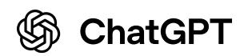
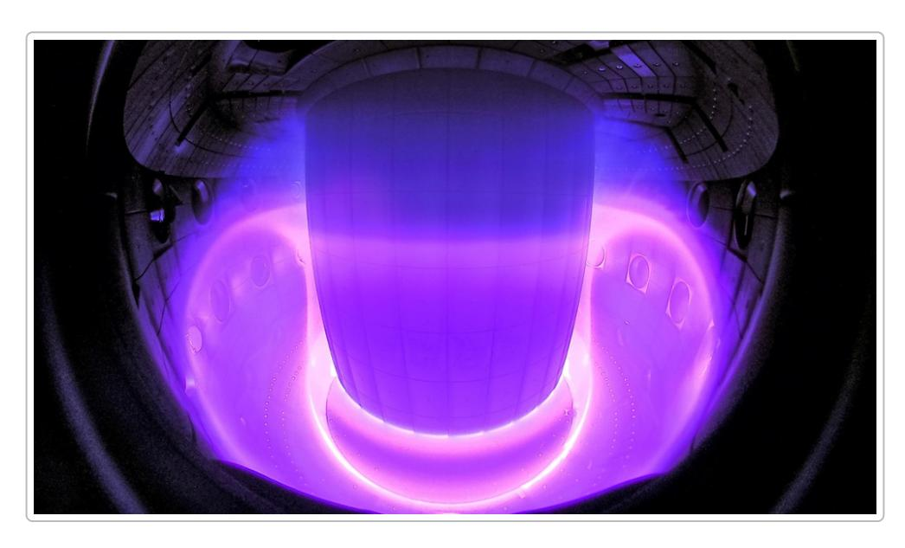
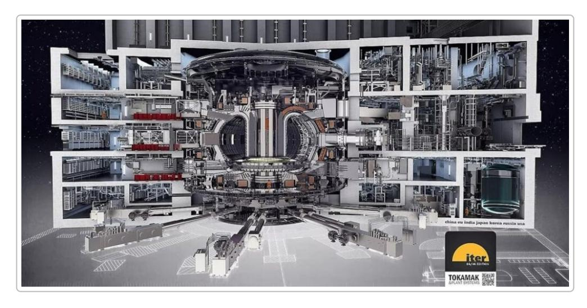

# Искусственный интеллект в термоядерной энергетике: применение, проекты и инструменты

## Введение

Термоядерная энергетика обещает практически неистощимый источник чистой энергии, воспроизводя на Земле реакцию синтеза, питающую звёзды. Однако управление раскалённой плазмой при температурах свыше 100 миллионов °С – задача огромной сложности. Современные эксперименты (токамаки, стеллараторы и др.) генерируют гигантские массивы данных и требуют точнейшего контроля, чтобы избежать нестабильностей и сбоев в плазме 1 2. В последние годы искусственный интеллект (Machine Learning, Deep Learning, нейросети) стремительно внедряется в эту сферу. Алгоритмы ИИ способны выявлять скрытые паттерны в данных и принимать решения быстрее человека, открывая новые пути оптимизации термоядерных реакторов 3 4. Ниже рассмотрены основные направления применения ИИ в управляемом термоядерном синтезе, конкретные примеры на крупнейших установках, текущие исследования и инициативы, а также обзор симуляторов, используемых для моделирования реакторов.

# Основные направления использования ИИ в термоядерных реакторах

### Управление плазмой

*Плазменный разряд внутри токамака (установка TCV). Управление формой и положением плазмы – ключевая задача, решаемая с помощью ИИ.*

Активное управление плазмой – одно из главных применений ИИ в токамаках. Традиционные системы управления используют раздельные регуляторы для каждого магнитного контура, тогда как современные подходы на базе **глубокого обучения с подкреплением (RL)** позволяют единым алгоритмом координировать десятки магнитных катушек и удерживать нестабильную плазму заданной формы . Прорывной пример – сотрудничество DeepMind и Швейцарского центра плазмы (EPFL): нейросетевой контроллер успешно управлял 19 магнитными катушками токамака TCV, самостоятельно «выучив» удерживать плазму и даже придавать ей различные конфигурации в реальном времени . С помощью такого RL-агента учёные **скульптурировали** плазму – создавали сложные формы, например разделяли плазменный сгусток на две отдельные «капли», удерживая их одновременно . Важность этого достижения в том, что некоторые полученные формы соответствуют конфигурациям, необходимым для будущего реактора ITER . [5](https://deepmind.google/blog/accelerating-fusion-science-through-learned-plasma-control/#:~:text=mission%20to%20advance%20science%2C%20we,to%20advance%20nuclear%20fusion%20research) [6](https://22century.ru/energetics/105772#:~:text=%D0%9A%D0%BE%D0%BC%D0%BF%D0%B0%D0%BD%D0%B8%D1%8F%20DeepMind%20%D1%80%D0%B0%D0%B7%D1%80%D0%B0%D0%B1%D0%BE%D1%82%D0%B0%D0%BB%D0%B0%20%D1%81%D0%B8%D1%81%D1%82%D0%B5%D0%BC%D1%83%20%D0%B8%D1%81%D0%BA%D1%83%D1%81%D1%81%D1%82%D0%B2%D0%B5%D0%BD%D0%BD%D0%BE%D0%B3%D0%BE,%D0%BA%D0%BE%D1%82%D0%BE%D1%80%D1%8B%D0%B9%20%D0%BF%D0%BB%D0%B0%D0%BD%D0%B8%D1%80%D1%83%D0%B5%D1%82%D1%81%D1%8F%20%D0%B7%D0%B0%D0%BF%D1%83%D1%81%D1%82%D0%B8%D1%82%D1%8C%20%D0%B2%C2%A02025%20%D0%B3%D0%BE%D0%B4%D1%83) [7](https://deepmind.google/blog/accelerating-fusion-science-through-learned-plasma-control/#:~:text=plasma%20never%20touches%20the%20walls,to%20advance%20nuclear%20fusion%20research) [6](https://22century.ru/energetics/105772#:~:text=%D0%9A%D0%BE%D0%BC%D0%BF%D0%B0%D0%BD%D0%B8%D1%8F%20DeepMind%20%D1%80%D0%B0%D0%B7%D1%80%D0%B0%D0%B1%D0%BE%D1%82%D0%B0%D0%BB%D0%B0%20%D1%81%D0%B8%D1%81%D1%82%D0%B5%D0%BC%D1%83%20%D0%B8%D1%81%D0%BA%D1%83%D1%81%D1%81%D1%82%D0%B2%D0%B5%D0%BD%D0%BD%D0%BE%D0%B3%D0%BE,%D0%BA%D0%BE%D1%82%D0%BE%D1%80%D1%8B%D0%B9%20%D0%BF%D0%BB%D0%B0%D0%BD%D0%B8%D1%80%D1%83%D0%B5%D1%82%D1%81%D1%8F%20%D0%B7%D0%B0%D0%BF%D1%83%D1%81%D1%82%D0%B8%D1%82%D1%8C%20%D0%B2%C2%A02025%20%D0%B3%D0%BE%D0%B4%D1%83) [8](https://22century.ru/energetics/105772#:~:text=%D0%B2%C2%A0%D0%B7%D0%B0%D0%B2%D0%B8%D1%81%D0%B8%D0%BC%D0%BE%D1%81%D1%82%D0%B8%20%D0%BE%D1%82%20%D0%BA%D0%BE%D0%BD%D1%84%D0%B8%D0%B3%D1%83%D1%80%D0%B0%D1%86%D0%B8%D0%B8%2019%20%D1%83%D0%BF%D1%80%D0%B0%D0%B2%D0%BB%D1%8F%D1%8E%D1%89%D0%B8%D1%85,%D1%83%D0%B4%D0%B0%D0%BB%D0%BE%D1%81%D1%8C%20%D1%80%D0%B0%D0%B7%D0%B4%D0%B5%D0%BB%D0%B8%D1%82%D1%8C%20%D0%BD%D0%B0%C2%A0%D0%B4%D0%B2%D0%B5%20%D0%BA%D0%B0%D0%BF%D0%BB%D0%B8%2C%20%D0%BE%D0%B4%D0%BD%D0%BE%D0%B2%D1%80%D0%B5%D0%BC%D0%B5%D0%BD%D0%BD%D0%BE) [9](https://22century.ru/energetics/105772#:~:text=%D1%83%D0%B4%D0%B5%D1%80%D0%B6%D0%B8%D0%B2%D0%B0%D1%8F%20%D0%B8%D1%85%20%D0%B2%C2%A0%D1%80%D0%B0%D0%B2%D0%BD%D0%BE%D0%B2%D0%B5%D1%81%D0%B8%D0%B8,%D0%B4%D0%BE%D0%BB%D0%B6%D0%BD%D0%B0%20%D0%BF%D1%80%D0%B8%D0%BD%D1%8F%D1%82%D1%8C%20%D0%B2%C2%A0%D1%81%D1%82%D1%80%D0%BE%D1%8F%D1%89%D0%B5%D0%BC%D1%81%D1%8F%20%D1%80%D0%B5%D0%B0%D0%BA%D1%82%D0%BE%D1%80%D0%B5%20ITER)

Помимо формы, ИИ помогает удерживать **стабильность плазмы**. В США на установке DIII-D продемонстрировано, как алгоритм глубокого RL, обученный в симуляции, интегрирует данные сотен датчиков и за доли миллисекунды корректирует магнитное поле, предотвращая возникновение опасных магнито-гидродинамических возмущений (островных нестабильностей) до того, как они разовьются . Этот подход позволил **избежать токовых срывов** (disruptions) путём упреждающей стабилизации плазмы в реальном времени . Как отмечают исследователи, такой AI-контроллер расширяет пространство возможных режимов работы – можно безопасно испытать сценарии, ранее считавшиеся слишком рискованными, и добиться более высокой производительности установки . Например, при помощи ИИ впервые удалось достичь устойчивого высококонфайнментного режима (H-mode) **без эвольвентных всплесков** (ELM) одновременно на двух разных токамаках (DIII-D в США и KSTAR в Корее) с использованием одного и того же алгоритма управления . Автоматизированные системы на основе ИИ способны принимать решения быстрее человека – регулировать токи катушек, подачу топлива, мощность подогрева плазмы – и тем самым поддерживать реакцию синтеза в устойчивом режиме длительное время . [10](https://www.energy.gov/science/fes/articles/ai-tackles-disruptive-tearing-instability-fusion-plasma#:~:text=ideal%20approach%20would%20be%20to,adaptive%20control%20that%20maintained%20stability) [11](https://www.energy.gov/science/fes/articles/ai-tackles-disruptive-tearing-instability-fusion-plasma#:~:text=The%20effective%20use%20of%20an,Finally%2C%20use%20of%20this) [12](https://www.energy.gov/science/fes/articles/ai-tackles-disruptive-tearing-instability-fusion-plasma#:~:text=prevention%20using%20AI%2Fdeep%20reinforcement%20learning,adaptive%20control%20that%20maintained%20stability) [13](https://www.energy.gov/science/fes/articles/ai-tackles-disruptive-tearing-instability-fusion-plasma#:~:text=plasma%20containment%20and%20stability%20in,The%20AI%2FDRL) [14](https://www.pppl.gov/news/2024/using-artificial-intelligence-speed-and-improve-most-computationally-intensive-aspects#:~:text=The%C2%A0second%20paper%2C%20published%20in%20Nature,without%20ELMs%20in%20a%20tokamak) [15](https://www.pppl.gov/news/2024/using-artificial-intelligence-speed-and-improve-most-computationally-intensive-aspects#:~:text=%E2%80%9CThe%20results%20are%20particularly%20impressive,fields%20to%20hold%20a%20plasma) [3](https://www.pppl.gov/news/2024/using-artificial-intelligence-speed-and-improve-most-computationally-intensive-aspects#:~:text=the%20plasma%20to%20generate%20as,energy%20as%20possible%2C%E2%80%9D%20said%20Kolemen) [4](https://www.pppl.gov/news/2024/using-artificial-intelligence-speed-and-improve-most-computationally-intensive-aspects#:~:text=Important%20decisions%20must%20be%20made,all%20before%20the%20instabilities%20occur)

### Диагностика и мониторинг

Термоядерные установки оснащены десятками высокотехнологичных диагностик (датчики магнитных полей, оптические и рентгеновские камеры, спектрометры, датчики нейтронов и др.), которые генерируют гигабайты информации за каждую секунду разряда . ИИ существенно упрощает анализ этих данных. Например, методы **машинного обучения** используются для автоматического обнаружения аномалий и помех в сигналах. В плазме часто встречаются **выбросы-«артефакты»** измерений – например, всплески сигнала из-за попадания нейтронов в диагностический детектор, не связанные с реальными процессами в плазме . Классические алгоритмы с трудом отличают такие выбросы, особенно в многомерных массивах данных. Специалисты из Института физики плазмы Макса Планка (IPP, Германия) разработали алгоритмы на основе стохастических моделей (процессы Стьюдента t) для надёжного выявления и исключения некорректных точек в массивах экспериментальных данных . Такой подход позволил не только очищать данные измерений, но и **восстанавливать отсутствующие данные** – например, если какой-то датчик временно вышел из строя, его показания можно интерполировать на основе данных других диагностик . [2](https://www.ipp.mpg.de/5372351/ki_in_der_Fusionsforschung_2023#:~:text=invisible%20to%20the%20human%20eye,second%20of%20a%20plasma%20discharge) [16](https://www.ipp.mpg.de/5372351/ki_in_der_Fusionsforschung_2023#:~:text=One%20of%20these%20papers%20deals,physical%20phenomenon%20actually%20being%20studied) [16](https://www.ipp.mpg.de/5372351/ki_in_der_Fusionsforschung_2023#:~:text=One%20of%20these%20papers%20deals,physical%20phenomenon%20actually%20being%20studied) [17](https://www.ipp.mpg.de/5372351/ki_in_der_Fusionsforschung_2023#:~:text=other%20researchers,possible%2C%20for%20example%20in%20the) [18](https://www.ipp.mpg.de/5372351/ki_in_der_Fusionsforschung_2023#:~:text=in%20plasma%20physics%2C%20however%2C%20multi,values%20of%20the%20other%20diagnostics)

ИИ помогает и в прямых задачах диагностики – распознавании состояний плазмы. **Компьютерное зрение** используется для анализа изображений плазмы и быстрых физических событий. К примеру, в стеллараторе Wendelstein 7-X применяются методы глубокого обучения для определения момента перехода к режиму **отрывa плазмы от дивертора** (detach) по видеоизображениям из внутрикамерных камер, что важно для защиты стенок от перегрева . Другие модели оценивают профили температуры и плотности по данным датчиков, улучшают пространственное разрешение измерений и т.д. Также разрабатываются **«цифровые двойники»** плазмы – постоянно обновляемые компьютерные модели, которые в реальном времени получают потоки диагностических данных и рассчитывают ключевые параметры плазмы (токи, профиль давления, положение границы и пр.) . Такие цифровые модели с помощью ИИ заполняют пробелы теоретических моделей и позволяют операторам лучше понимать эволюцию разряда. Например, нейросеть, обученная на результатах кода равновесия (EFIT), была внедрена на токамаке EAST для мгновенной оценки положения плазмы и скорости ее вертикального смещения – в реальном времени и с учётом неопределённости измерений . Зная точную форму плазмы и доверительный интервал, система управления может адекватнее реагировать: если отклонение формы велико и достоверно – немедленно корректировать магнитное поле; если же измерения неопределённы – игнорировать ложный сигнал . Таким образом, ИИ усиливает возможности диагностики, позволяя **мониторить плазму с беспрецедентной точностью** и надежностью. [19](https://www.mdpi.com/2076-3417/12/1/269#:~:text=Detecting%20Plasma%20Detachment%20in%20the,by%20the%20Event%20Detection) [20](https://www.futura-sciences.com/en/nuclear-fusion-meets-ai-plasma-feats-that-are-leaving-researchers-speechless_21036/#:~:text=AI%20also%20sharpens%20diagnostics%2C%20flags,accelerates%20simulations%20with%20digital%20twins) [21](https://www.ipp.mpg.de/5372351/ki_in_der_Fusionsforschung_2023#:~:text=Only%20if%20the%20position%20and,time%20determine%20which%20error%20range) [22](https://conferences.iaea.org/event/377/contributions/31638/contribution.pdf#:~:text=with%20Alcator%20C,RL%29%20model%20to%20train) [23](https://www.ipp.mpg.de/5372351/ki_in_der_Fusionsforschung_2023#:~:text=it%20is%20important%20to%20estimate,the%20plasma%20equilibrium%20and%20a) [23](https://www.ipp.mpg.de/5372351/ki_in_der_Fusionsforschung_2023#:~:text=it%20is%20important%20to%20estimate,the%20plasma%20equilibrium%20and%20a)

### Прогнозирование сбоев и предотвращение аварий

Одной из самых опасных ситуаций в токамаке является **дисрупция** – внезапная потеря удержания плазмы, сопровождающаяся выбросом колоссальной энергии и силовых нагрузок на стенки реактора. Предсказание подобных сбоев заранее – краеугольный камень безопасной работы ITER и других реакторов . ИИ уже продемонстрировал здесь свою эффективность. В Принстонской лаборатории физики плазмы (PPPL) разработали алгоритм, обученный на тысячах прошлых разрядов DIII-D, который **предсказывает приближение дисрупции за 30–300 мс до события**, распознав характерные предвестники в показаниях датчиков . В случае повышенного риска система автоматически инициирует меры смягчения – например, впрыск поглощающих примесей или разгрузку тока – чтобы стабилизировать плазму и избежать аварии . В испытаниях такой ИИмодуль на DIII-D смог предупредить срыв ~300 мс заранее и благодаря этому полностью предотвратить разрушение разряда . [24](https://www.pppl.gov/news/2021/artificial-intelligence-helps-prevent-disruptions-fusion-devices#:~:text=Fusion%20devices%20called%20tokamaks%20run,the%20practicality%20of%20fusion%20energy) [25](https://www.pppl.gov/news/2021/artificial-intelligence-helps-prevent-disruptions-fusion-devices#:~:text=Scientists%20thus%20must%20be%20able,the%20practicality%20of%20fusion%20energy) [26](https://www.futura-sciences.com/en/nuclear-fusion-meets-ai-plasma-feats-that-are-leaving-researchers-speechless_21036/#:~:text=Another%20milestone%20is%20disruption%20prediction,signs%20of%20sudden%2C%20damaging%20events) [27](https://www.futura-sciences.com/en/nuclear-fusion-meets-ai-plasma-feats-that-are-leaving-researchers-speechless_21036/#:~:text=On%20the%20DIII,to%20more%20dynamic%20fusion%20control) [28](https://www.futura-sciences.com/en/nuclear-fusion-meets-ai-plasma-feats-that-are-leaving-researchers-speechless_21036/#:~:text=On%20the%20DIII,results%20point%20to%20more%20dynamic)

Подобные модели используют разные методы ML – от нейронных сетей (CNN, LSTM) до случайных лесов и градиентного бустинга. На китайском токамаке EAST сформирована база данных всех случаев срывов, и целый ансамбль алгоритмов (сверточные и рекуррентные сети, Random Forest, XGBoost) обучен различать типичные причины нарушений – всплески примесей, марфы (MARFE) и прочие нестабильности . Более того, применяется **перенос обучения между установками**: используя архивы Алькатора C-Mod (США) и JET (Европа), модели, обученные на одних машинах, адаптируются для прогнозирования сбоев на других . Такой межмашинный ИИ-подход повышает надёжность, позволяя учитывать более разнообразные сценарии, чем доступны на одной установке. Важным направлением становится и **объяснимый ИИ** (XAI): учёные стремятся не только получить верный прогноз, но и понять, какие физические признаки указывают на надвигающийся срыв . Это помогает встроить прогнозирующие модели в систему управления, где они будут работать совместно с традиционными контроллерами, повышая общую устойчивость реактора к сбоям. [29](https://conferences.iaea.org/event/377/contributions/31638/contribution.pdf#:~:text=and%20in%20control%20of%20plasma,In%20order%20to%20get%20more) [30](https://conferences.iaea.org/event/377/contributions/31638/contribution.pdf#:~:text=database,In%20order%20to%20get%20more) [31](https://euro-fusion.org/eurofusion-news/eurofusion-spearheads-advances-in-artificial-intelligence-and-machine-learning-to-unlock-fusion-energy/#:~:text=understanding%20of%20these%20phenomena) [32](https://euro-fusion.org/eurofusion-news/eurofusion-spearheads-advances-in-artificial-intelligence-and-machine-learning-to-unlock-fusion-energy/#:~:text=Artificial%20Intelligence,Tokamak%20Disruption%20Prediction%20and%20Control)

### Оптимизация конструкции и режимов реакторов

ИИ используется не только в операционном контроле, но и на стадии проектирования термоядерных установок. **Цифровые модели реакторов**, усиленные ML, позволяют исследовать огромное пространство параметров и находить оптимальные конфигурации, которые было бы трудно подобрать вручную. Например, команда DeepMind совместно с Commonwealth Fusion Systems (разработчик компактного реактора **SPARC**) создала дифференцируемый симулятор плазмы **TORAX** на базе JAX, способный быстро просчитывать поведение плазмы при различных настройках . Этот симулятор интегрируется с методами AI-оптимизации: **агенты на основе RL и эволюционных алгоритмов** (такие как AlphaEvolve) перебирают тысячи сценариев нагрева, токов магнитов, топливной подачи и т.п., чтобы максимизировать выходную мощность при соблюдении ограничений по стабильности . В виртуальных экспериментах TORAX находит комбинации настроек, обещающие наибольшую энерговыработку для SPARC, экономя месяцы реального времени и фокусируя внимание инженеров на самых перспективных режимах . [33](https://deepmind.google/blog/bringing-ai-to-the-next-generation-of-fusion-energy/#:~:text=This%20partnership%20builds%20on%20our,plasma%20simulator%20written%20in%20JAX) [34](https://deepmind.google/blog/bringing-ai-to-the-next-generation-of-fusion-energy/#:~:text=plasma%20shapes,plasma%20simulator%20written%20in%20JAX) [35](https://deepmind.google/blog/bringing-ai-to-the-next-generation-of-fusion-energy/#:~:text=Operating%20a%20tokamak%20involves%20countless,limits%2C%20could%20be%20very%20inefficient) [36](https://deepmind.google/blog/bringing-ai-to-the-next-generation-of-fusion-energy/#:~:text=Using%20TORAX%20in%20combination%20with,and%20operating%20at%20full%20power) [36](https://deepmind.google/blog/bringing-ai-to-the-next-generation-of-fusion-energy/#:~:text=Using%20TORAX%20in%20combination%20with,and%20operating%20at%20full%20power) [37](https://deepmind.google/blog/bringing-ai-to-the-next-generation-of-fusion-energy/#:~:text=the%20most%20promising%20strategies%2C%20increasing,and%20operating%20at%20full%20power)

ИИ помогает и в **оптимизации конструкции магнитных конфигураций**. Стеллараторам, например, присущи сложные изогнутые магнитные поверхности. Инструменты AI/ML применяют для улучшения форм магнитных катушек и поля: в PPPL разрабатываются алгоритмы, которые учитывают сразу множество кодов для разных аспектов конструкции стелларатора и с помощью обучения находят баланс между детализированной точностью моделирования и приемлемым временем расчёта . Такой подход ускоряет итерации проектирования: вместо ручного перебора, ИИ подсказывает, как изменение геометрии или токов повлияет на удержание плазмы. В перспективе, это путь к созданию **«цифрового двойника» реактора** – комплексной модели, которая калибруется по экспериментальным данным и может предсказывать поведение установки при новых конфигурациях. Как отметил д-р Майкл Черчилль (PPPL), идеальный цифровой двойник будет получать обратную связь от реального реактора и уточнять расчёты, позволяя с высокой точностью прогнозировать будущую производительность и выявлять оптимальные конструктивные решения . [38](https://www.pppl.gov/news/2024/using-artificial-intelligence-speed-and-improve-most-computationally-intensive-aspects#:~:text=PPPL%E2%80%99s%20artificial%20intelligence%20projects%20for,a%20more%20complex%2C%20twisted%20design) [39](https://www.pppl.gov/news/2024/using-artificial-intelligence-speed-and-improve-most-computationally-intensive-aspects#:~:text=%E2%80%9CWe%20need%20to%20leverage%20a,%E2%80%9D) [40](https://www.pppl.gov/news/2024/using-artificial-intelligence-speed-and-improve-most-computationally-intensive-aspects#:~:text=there%E2%80%99s%20quite%20a%20bit%20that,%E2%80%9D) [41](https://www.pppl.gov/news/2024/using-artificial-intelligence-speed-and-improve-most-computationally-intensive-aspects#:~:text=Churchill%20said%20ideally%2C%20you%20want,%E2%80%9D)

Отдельно стоит упомянуть применение ИИ к инерциальному синтезу (лазерному термояду): хотя вопрос фокусируется на реакторах с магнитным удержанием, методы ML также оптимизируют **лазерные импульсы** и мишени в установках вроде NIF (США) и OMEGA. Нейросети помогли подобрать форму лазерного импульса, которая в экспериментах увеличила выход энергии синтеза в три раза , а алгоритмы **inverse design** («обратного проектирования») рекомендуют параметры облучения мишени, чтобы приблизиться к условию зажигания . Эти успехи в сумме показывают, что ИИ стал важным инструментом, ускоряющим переход от научных экспериментов к инженерным решениям для промышленной термоядерной энергетики. [42](https://www.futura-sciences.com/en/nuclear-fusion-meets-ai-plasma-feats-that-are-leaving-researchers-speechless_21036/#:~:text=At%20the%20University%20of%20Rochester%2C,and%20trillionths%20of%20a%20second) [43](https://www.futura-sciences.com/en/nuclear-fusion-meets-ai-plasma-feats-that-are-leaving-researchers-speechless_21036/#:~:text=AI%20narrows%20the%20gap%20between,rapidly%20without%20testing%20every%20option)

### Ускорение физических симуляций

Многие вычислительные задачи в физике плазмы чрезвычайно ресурсоёмки. ИИ способен служить своего рода *ускорителем* для таких расчётов, заменяя медленные численные алгоритмы быстрыми апроксимирующими моделями. Пример – симуляция кулоновских столкновений в плазме: прямое решение интегро-дифференциального оператора Фоккера–Планка–Ландау (FPL) требует больших вычислительных затрат. Группа в UNIST (Южная Корея) под руководством Чимина Ли разработала нейросетевую модель **FPL-net**, которая решает уравнение столкновений **за один шаг**, показывая ускорение расчётов в 1000 раз по сравнению с классическими методами при ошибке менее 0,001% 44 45. Ключевым было внедрение физических законов сохранения (заряда, импульса, энергии) прямо в архитектуру сети, чтобы она соблюдала эти инварианты при прогнозе 46. Такой подход позволил проводить длинные расчёты эволюции плазмы без накопления ошибок, вплоть до достижения термализации, что ранее было трудно из-за погрешностей итерационных схем 47. Авторы отмечают, что использование GPU и глубокого обучения дало тысячекратный прирост скорости и фактически заложило основу для **«цифровых двойников токамаков»**, где быстрое моделирование турбулентности и других процессов идёт в реальном масштабе времени 48.

Схожие работы ведутся и в Европе. В рамках EUROfusion запущен ряд проектов по применению ML для ускорения конкретных физических расчётов. Так, команда д-ра Aaro Järvinen (VTT, Финляндия) создает метод машинного обучения для сверхбыстрого вычисления устойчивости краевого плазменного слоя (пьедестала) 49. Сейчас подобные МНD-стабильностные расчёты (например, оценка предела токов токамака по критерию идеальной локальной моды) занимают часы суперкомпьютерного времени, что непригодно для оперативного управления. Цель – получить ML-модель, которая за мгновение будет предсказывать, стабилен ли текущий профиль плазмы, и тем самым её можно будет использовать on-line в контуре управления 50. Другой пример – проект, который возглавляет проф. Герт Вердулаеге (Университет Гента, Бельгия): комбинация байесовских методов и ML для выявления универсальных зависимостей в режимах гибридного конфайнмента на разных установках и предсказания оптимальных условий для будущих реакторов (ITER и последующих) 51. Такие модели фактически выступают быстрыми предикторами выхода энергии и границ устойчивости плазмы, обученными на огромных массивах экспериментальных и моделированных данных.

Наконец, ИИ облегчает многопроцессорные *first-principle* симуляции. Существуют сложнейшие коды, моделирующие плазму на уровне частиц и полей (например, **XGC** для кинетического моделирования токамаков), которые требуют мощнейших суперкомпьютеров 52. Комбинирование их с ML обещает создание **гибридных моделей**: например, нейросеть может угадывать результат дорогостоящей части расчёта (скажем, турбулентного переноса) по состоянию системы, а более медленный основной код будет обрабатываться реже или меньшим масштабом. Таким образом, совмещая физические модели с обучаемыми аппроксиматорами, можно ускорить симуляции на порядки без критической потери точности 53. Подобные «симбиозы» классического моделирования и ИИ уже используются при анализе экспериментов и позволят в будущем в реальном времени прогнозировать эволюцию плазмы на основе потоков входящих данных 54.

### Прогнозирование выхода энергии и эффективности

ИИ-приложения охватывают и задачу **оценки энергии, производимой реактором**, и оптимизации этой величины. Современные токамаки и прототипы реакторов оснащаются множеством диагностик, по сигналам которых требуется оперативно вычислить *внутренние параметры разряда* – например, текущую мощность синтеза (в D-T плазме). Классический пример – гамма-спектрометрия: при реакциях D+T образуются высокоэнергетические гамма-кванты, и по их спектру можно оценить выход мощности. В рамках подготовки к ITER был разработан метод с применением **машинного обучения для оценки мощности синтеза** по данным радиального гамма-спектрометра (RGRS) 55. Алгоритм, обученный на модельных и экспериментальных данных (включая кампанию D-T на JET), способен мгновенно выдавать абсолютную мощность реакций, что важно для контроля баланса энергии в реакторе.

Ещё одна область – поиск режимов с улучшенным энерговыделением. Ранее упомянутые гибридные режимы и режимы без ELM – это примеры, где ИИ помог достичь высокого удержания плазмы и, соответственно, большого коэффициента усиления реакции (Q). На КSTAR, благодаря АІ-контролю, удалось впервые долго удерживать H-mode без колебаний, что обеспечивает более высокую производительность установки 14. В целом, системы АІ стремятся максимизировать выход энергии, не жертвуя стабильностью. Как отметил профессор Эгемен Колемен, задача ИИ – позволить плазме генерировать максимум энергии синтеза при одновременном избегании опасных нестабильностей 56. 4. Для этого алгоритмы рассматривают множество компромиссных вариантов – например, чуть повысить плотность ради лучшего удержания, но не настолько, чтобы спровоцировать разрядку тока; или подобрать форму плазмы, дающую оптимальный объём и давление.

Наконец, ИИ используется для **долгосрочных прогнозов эффективности** энергетических установок. С его помощью оценивают экономические параметры – например, пакет FAROES от UKAEA применяет Python-оптимизацию для расчёта стоимости энергии и капзатрат разных проектов реакторов 57. В совокупности, инструментарий ML позволяет переходить от отдельных экспериментов к системной оптимизации будущих электростанций, где одновременно учитываются физика плазмы, материалы, экономика и надёжность.

## Примеры применения ИИ в крупнейших проектах и установках

Разрез проекта ITER – крупнейшего термоядерного токамака. В таких сложных установках ИИ применяется для анализа огромных массивов данных и управления плазмой.

ITER (Франция) – международный токамак нового поколения – станет полигоном для широкого применения ИИ. Ожидается, что при выходе на полную мощность ITER будет генерировать порядка 2 петабайт данных в сутки, и без продвинутых методов анализа с этим объёмом не справиться 

Уже сейчас, задолго до первой плазмы, команды EUROfusion и ITER разрабатывают АІ-решения для управления: системы предсказания срывов (с учётом опыта JET, DIII-D и других токамаков), интеллектуальные алгоритмы для поддержания формы плазмы при рекордно долгих импульсах 

∼1000 секунд, автоматизированные обработчики диагностики и т.д. Особое внимание уделяется интеграции ИИ в контур управления ITER – модели должны работать почти в реальном времени и

быть устойчивы к шумам и отказам сенсоров 58 59 . Европейская программа EUROfusion в 2024 году запустила 15 проектов по ИИ для термояда, многие из которых нацелены прямо на задачи ITER 60 61 . Например, проект Prof. Verdoolaege (Бельгия) ищет ML-методы, чтобы перенести улучшенные режимы конфайнмента с существующих токамаков на ITER 51 , а команда Dr. Vicente (Португалия) применяет глубокое обучение для улучшения обработки сигналов рефлектометрии, что позволит точно контролировать профили плотности на ITER 62 . Таким образом, ITER станет вершиной слияния больших данных и ИИ: от рутинизированной фильтрации данных до автономного ведения разряда, обеспечивая стабильную работу самого большого в истории реактора.

**ЈЕТ (Англия)** – крупнейший европейский токамак (диам. ~3 м), где недавно был установлен мировой рекорд по энергии слияния (59 МДж, 2022 г.). На ЈЕТ отрабатывались многие подходы, которые теперь перенимаются ИИ. Например, еще в 2019 г. была показана возможность межмашинного МL: алгоритм, обученный на JET, успешно предсказывал срывы на американском токамаке TC-V 63 64 . В экспериментах ЈЕТ с дейтерий-тритиевой смесью используются нейросети для быстрой оценки выделяемой мощности по данным диагностики (гамма-спектрометры, нейтронные детекторы) – эта информация критически важна для управления подводом топлива и эффективности выгорания трития 55 . Кроме того, ЈЕТ служит испытательным стендом для технологий контроля, необходимых ITER: так, системы экстренного тушения плазмы (массированного газового впрыска) могут активироваться на основе рекомендаций ML-модели, следящей за поведением плазмы. Не менее важно, что ЈЕТ накопил обширный архив данных за десятилетия – и теперь эти данные используются для обучения новых AI-систем. Проекты EUROfusion активно привлекают базу JET: скажем, для обучения нейросетей, восстанавливающих профиль тока в плазме, либо для алгоритмов распознавания образов в больших видеоархивах (визуальные наблюдения разрядов) 65. Таким образом, ЈЕТ связывает поколения экспериментов, помогая ИИ найти общие закономерности в поведении плазмы, которые затем можно применить в будущих реакторах.

**EAST (Китай)** – суперпроводящий токамак с самым долгим удержанием плазмы (в 2021 г. удалось поддерживать плазму 1056 секунд). В проекте EAST ИИ внедряется во многих аспектах. Как отмечалось, на EAST реализована **многоуровневая система предсказания сбоев**, обученная на локальных и зарубежных данных 29. Но помимо этого, китайские учёные применили ИИ для **улучшения традиционных контроллеров**. К примеру, нейросеть, обученная на моделях плазмы, была использована для **самонастройки вертикального стабилизатора**: она в режиме реального времени оценивает параметр роста плазмы и подстраивает коэффициенты ПИД-регулятора, чтобы предотвратить потерю вертикальной устойчивости 66 67. Это повысило надёжность удержания столба плазмы, особенно в длительных импульсах. Ещё одно достижение – с помощью RL-алгоритма на EAST реализовано **автоматическое поддержание давления плазмы**: на основе идентификационной модели плазмы с нагревом СВЧ (Lower Hybrid) обучен агент, управляющий мощностью нагрева так, чтобы давление оставалось на заданном уровне 68 69. В результате EAST становится одной из самых «умных» установок, где ИИ не только прогнозирует проблемы, но и **активно ведёт разряд**, оптимизируя его параметры. Благодаря этим технологиям EAST регулярно устанавливает рекорды длительности и стабильности, подтверждая эффективность АІ-подходов.

**SPARC (США)** – частный проект компании CFS (от MIT) по созданию компактного реактора с выходом в энергоположительный режим. SPARC отличают мощные высокотемпературные сверхпроводники и расчет на достижение **коэффициента усиления Q>1**. В 2023 году компания объявила о партнёрстве с DeepMind для применения ИИ в трёх ключевых направлениях: высокоскоростное дифференцируемое моделирование плазмы, оптимизация пути к максимальной энергии и

управление плазмой в реальном времени с помощью RL . Практически это означает, что ещё до запуска SPARC его **цифровой двойник** будет проигрывать миллионы виртуальных импульсов, чтобы выбрать оптимальные режимы работы . Симулятор TORAX уже стал частью ежедневной работы команды SPARC, позволяя быстро проверять гипотезы и корректировать план экспериментов . Например, ИИ-модели перебирают варианты формы импульса тока и сценариев нагрева, чтобы **перейти в режим зажигания с минимальными затратами времени** . Поскольку SPARC должен быть первым реактором с положительным выходом энергии, ставка на ИИ здесь особенно высока: по оценке CFS, AI-инструменты помогут сэкономить годы попыток и избежать тупиковых режимов, сразу сфокусировавшись на наиболее результативных стратегиях . [70](https://deepmind.google/blog/bringing-ai-to-the-next-generation-of-fusion-energy/#:~:text=Now%2C%20we%E2%80%99re%20bringing%20that%20work,three%20key%20areas%20so%20far) [71](https://deepmind.google/blog/bringing-ai-to-the-next-generation-of-fusion-energy/#:~:text=could%20address%20beyond%20magnetic%20simulation,to%20achieve%20even%20better%20performance) [72](https://deepmind.google/blog/bringing-ai-to-the-next-generation-of-fusion-energy/#:~:text=TORAX%20will%20help%20CFS%20teams,once%20the%20first%20data%20arrives) [73](https://deepmind.google/blog/bringing-ai-to-the-next-generation-of-fusion-energy/#:~:text=including%20our%20own%2C%20to%20achieve,even%20better%20performance) [35](https://deepmind.google/blog/bringing-ai-to-the-next-generation-of-fusion-energy/#:~:text=Operating%20a%20tokamak%20involves%20countless,limits%2C%20could%20be%20very%20inefficient) [36](https://deepmind.google/blog/bringing-ai-to-the-next-generation-of-fusion-energy/#:~:text=Using%20TORAX%20in%20combination%20with,and%20operating%20at%20full%20power) [74](https://tokamakenergy.com/2024/01/17/ai-will-accelerate-path-to-clean-fusion-energy-in-fight-against-climate-change/#:~:text=The%20best%20supercomputers%20are%20so,time%20to%20make%20a%20difference)

**Wendelstein 7-X (Германия)** – крупнейший стелларатор, отличающийся своей сложной «скрученной» магнитной конфигурацией. В W7-X благодаря форме отсутствуют крупномасштабные разрывы плазмы, но задачи удержания и контроля не менее сложны, чем в токамаках. Здесь ИИ задействован прежде всего в сфере диагностики и **точного контроля профилей**. Установка оснащена десятками диагностических систем, и институт IPP (эксплуататор W7-X) активно внедряет ML для обработки их данных . Упомянутая ранее система определения равновесия и формы плазмы с оценкой погрешности – прямое приложение для W7-X, позволяющее оперативно настраивать магнитное поле и газовую подпитку для поддержания оптимального состояния плазмы . Кроме того, на W7-X проводятся исследования по управлению тепловой нагрузкой на дивертор: например, ML-алгоритмы отслеживают наступление режимов частичного или полного отрыва потока плазмы от материалов (detach) по сигналам камер и датчиков давления, позволяя автоматике вовремя увеличивать газовую подпитку для охлаждения краёв плазмы. В работе M. Szucs и др. (2022) продемонстрировано использование **классификаторов изображений** для детектирования момента отрыва по видео W7- X – некоторые алгоритмы (например, градиентный бустинг) достигли точности свыше 95% в распознавании необходимого состояния плазмы . Таким образом, даже в столь нетривиальной системе, как стелларатор, ИИ нашёл применение: он помогает экспериментаторам видеть невидимое (плазму целиком не измеришь напрямую) и стабилизировать её параметры в реальном времени. [75](https://www.ipp.mpg.de/5372351/ki_in_der_Fusionsforschung_2023#:~:text=In%20order%20to%20be%20able,and%20derive%20principles%20from%20them) [76](https://www.ipp.mpg.de/5372351/ki_in_der_Fusionsforschung_2023#:~:text=The%20most%20recent%20example%20of,editorial%20team%20for%20the%20issue) [21](https://www.ipp.mpg.de/5372351/ki_in_der_Fusionsforschung_2023#:~:text=Only%20if%20the%20position%20and,time%20determine%20which%20error%20range) [77](https://www.ipp.mpg.de/5372351/ki_in_der_Fusionsforschung_2023#:~:text=it%20is%20important%20to%20estimate,making%20in%20experiment%20control) [19](https://www.mdpi.com/2076-3417/12/1/269#:~:text=Detecting%20Plasma%20Detachment%20in%20the,by%20the%20Event%20Detection)

**K-STAR (Южная Корея)** – корейский сверхпроводящий токамак, известный рекордными длительными импульсами H-мода (до 8 минут). Для достижения таких результатов KSTAR активно применяет передовые алгоритмы контроля, и ML играет растущую роль. Корейские ученые совместно с PPPL реализовали на KSTAR **нейросетевую систему подавления edgeлокализованных мод (ELM)** – фактически тот же алгоритм, что и на DIII-D, позволил удержать высокое confinементное состояние без ELM, о чём сообщалось в Nature Communications . Кроме того, KSTAR участвует в международных проектах по передаче алгоритмов: так, код предсказания срывов, разработанный на данных DIII-D, тестировался и на KSTAR, что подтвердило его универсальность . Для будущего маршрута KSTAR (планируемого реактора K-DEMO) рассматривается глубокая интеграция AI: создаются имитационные модели «KSTAR-NN» – открытая платформа на Python для моделирования токамака KSTAR с использованием нейросетевых приближений . Она позволит инженерам проверять новые идеи управления плазмой виртуально, не рискуя дорогой установкой. В итоге KSTAR сейчас – это **испытательный полигон** AI-контроля длительных импульсов, а полученные знания будут перенесены на проектируемую промышленную установку. [14](https://www.pppl.gov/news/2024/using-artificial-intelligence-speed-and-improve-most-computationally-intensive-aspects#:~:text=The%C2%A0second%20paper%2C%20published%20in%20Nature,without%20ELMs%20in%20a%20tokamak) [15](https://www.pppl.gov/news/2024/using-artificial-intelligence-speed-and-improve-most-computationally-intensive-aspects#:~:text=%E2%80%9CThe%20results%20are%20particularly%20impressive,fields%20to%20hold%20a%20plasma) [63](https://www.pppl.gov/news/2024/using-artificial-intelligence-speed-and-improve-most-computationally-intensive-aspects#:~:text=PPPL%20has%20a%20significant%20history,tokamak%20to%20another%20in%202019) [78](https://github.com/kripnerl/fusion-open-source#:~:text=,User%27s%20stars%3A%20KSTAR%20tokamak%20simulator)

Помимо перечисленных, есть и другие проекты, где ИИ играет заметную роль: **DIII-D** (США) – пионер многих ML-систем, **TCV** (Швейцария) – первая площадка для DeepMind RL-контроллера плазмы,

**JT-60SA** (Япония–Европа) – новый токамак, где планируется использовать AI для управления долгими импульсами, **General Fusion, TAE Technologies, Zap Energy** – стартапы с альтернативными подходами к синтезу, также изучающие применение машинного обучения для оптимизации своих установок. Весь мир термояда движется к тому, что без искусственного интеллекта эффективное управление реакцией слияния практически невозможно – настолько сложна и тонка эта задача. Как образно заметил один из руководителей Tokamak Energy, **«цифровой двойник реактора и ИИ способны отвоевать годы на пути к коммерческому термояду»**, сэкономив время и ресурсы в гонке за чистой энергией . [74](https://tokamakenergy.com/2024/01/17/ai-will-accelerate-path-to-clean-fusion-energy-in-fight-against-climate-change/#:~:text=The%20best%20supercomputers%20are%20so,time%20to%20make%20a%20difference) [79](https://tokamakenergy.com/2024/01/17/ai-will-accelerate-path-to-clean-fusion-energy-in-fight-against-climate-change/#:~:text=Digital%20twin)

## **Научные исследования, индустриальные инициативы и стартапы**

В области применения ИИ для управляемого термояда активно участвуют как академические лаборатории, так и промышленность. С научной стороны, крупные программы координируются международными организациями: так, **EUROfusion** в Европе спонсирует серию проектов (см. выше) по ML в физике плазмы . Также проводятся специализированные конференции (например, IAEA Technical Meeting on Fusion Data Processing, сессии по Machine Learning в Plasma Physics конференциях). Журналы отмечают рост публикаций: вышли специальные выпуски, посвящённые ML в физике плазмы (например, Contributions to Plasma Physics, июнь 2023, где 3 из 12 статей – от группы IPP ). Исследуются самые разные аспекты: от **physics-informed нейросетей** (PINN), где сетям прививаются физические ограничения, до **интерпретируемого ИИ**, позволяющего выяснить, какие закономерности он нашёл в данных реактора . В США в 2020-х действуют программы DoE, например, SciDAC-projects, направленные на интеграцию AI и высокопроизводительных вычислений для термояда – классический пример работа проф. Уильяма Танга (PPPL) по использованию суперкомпьютеров и нейросетей для межмашинного прогнозирования сбоев . В Китае при проекте CFETR (демо-реактор) также заложена обширная программа «умного реактора», объединяющая университеты и институты CAS в разработке алгоритмов автоматизированного управления. Таким образом, академическая наука формирует фундаментальные методики и открытые результаты, доступные всему сообществу. [60](https://euro-fusion.org/eurofusion-news/eurofusion-spearheads-advances-in-artificial-intelligence-and-machine-learning-to-unlock-fusion-energy/#:~:text=By%20launching%2015%20new%20research,the%20road%20to%20energy%20applications) [80](https://euro-fusion.org/eurofusion-news/eurofusion-spearheads-advances-in-artificial-intelligence-and-machine-learning-to-unlock-fusion-energy/#:~:text=Following%20a%20call%20and%20selection,techniques%20for%20magnetically%20confined%20plasmas) [81](https://www.ipp.mpg.de/5372351/ki_in_der_Fusionsforschung_2023#:~:text=,editorial%20team%20for%20the%20issue) [82](https://euro-fusion.org/eurofusion-news/eurofusion-spearheads-advances-in-artificial-intelligence-and-machine-learning-to-unlock-fusion-energy/#:~:text=effects%2C%20and%20processing%20data%20rapidly,our%20understanding%20of%20these%20phenomena) [32](https://euro-fusion.org/eurofusion-news/eurofusion-spearheads-advances-in-artificial-intelligence-and-machine-learning-to-unlock-fusion-energy/#:~:text=Artificial%20Intelligence,Tokamak%20Disruption%20Prediction%20and%20Control) [63](https://www.pppl.gov/news/2024/using-artificial-intelligence-speed-and-improve-most-computationally-intensive-aspects#:~:text=PPPL%20has%20a%20significant%20history,tokamak%20to%20another%20in%202019) [64](https://www.pppl.gov/news/2024/using-artificial-intelligence-speed-and-improve-most-computationally-intensive-aspects#:~:text=learning%20together%20with%20powerful%2C%20modern,%E2%80%9D)

В индустрии и среди стартапов наблюдается настоящий бум применения ИИ в гонке за первым энергоположительным синтезом. **Commonwealth Fusion Systems (CFS)** – одна из ведущих частных компаний – официально партнерится с AI-лидерами (DeepMind) для ускорения выхода на сетевую мощность . **Tokamak Energy** (Великобритания) инвестирует в создание цифровых двойников своих токамаков: как описывал сооснователь Дэвид Кингхэм, цифровая платформа позволяет прогонять импульсы реактора в тысячи раз быстрее реального времени и таким образом «обшаривать» огромное пространство возможностей, экономя годы развития . Многие стартапы (TAE, Helion, General Fusion и др.) имеют сильные команды по анализу данных: они используют ML для оптимизации параметров плазмы в каждом эксперименте, выжимая максимум информации из ограниченного числа пусков (что критично, так как частота экспериментов ограничена). Интересный пример – компания **ITER AI** (стартап, не связанный с проектом ITER, несмотря на название): она разрабатывает программные комплексы на основе больших моделей (включая мультимодальные модели и интерфейсы с LLM) для помощи операторам термоядных установок, в том числе **разговорные интерфейсы** для управления токамаками . Идея в том, чтобы оператор мог задавать системе вопросы (на естественном языке) о состоянии реактора и [83](https://deepmind.google/blog/bringing-ai-to-the-next-generation-of-fusion-energy/#:~:text=Today%2C%20we%E2%80%99re%20announcing%20our%20research,powerful%20tokamak%20machine%20called%20SPARC) [70](https://deepmind.google/blog/bringing-ai-to-the-next-generation-of-fusion-energy/#:~:text=Now%2C%20we%E2%80%99re%20bringing%20that%20work,three%20key%20areas%20so%20far) [79](https://tokamakenergy.com/2024/01/17/ai-will-accelerate-path-to-clean-fusion-energy-in-fight-against-climate-change/#:~:text=Digital%20twin) [84](https://tokamakenergy.com/2024/01/17/ai-will-accelerate-path-to-clean-fusion-energy-in-fight-against-climate-change/#:~:text=Crucially%2C%20these%20experiments%20produce%20real%2C,twin%20simulations%20become%20really%20valuable) [85](https://euro-fusion.org/eurofusion-news/eurofusion-spearheads-advances-in-artificial-intelligence-and-machine-learning-to-unlock-fusion-energy/#:~:text=Feda%20Almuhisen%20%28CEA%20%2F%20Aix,Using%20Multimodal%20Large%20Language%20Models)

получать рекомендации, основанные на анализе многомерных данных – своего рода интеллектуальный помощник для управляющей команды.

Отдельно стоит отметить участие компаний Big Tech. **Google DeepMind** мы уже упоминали – помимо контроллера TCV и проекта с CFS, они ведут исследование "AI for Plasma Science" в целом, выпуская открытые инструменты (например, TORAX выложен в открытый доступ на GitHub 86 87). **Microsoft** также инвестирует в термояд: недавно их облачное подразделение Azure запустило инициативу поддержать вычислительные нужды проектов синтеза, включая AI-анализ (пример – сотрудничество с Helion Energy). **NVIDIA** интересуется задачами ускорения симуляций плазмы на GPU – их исследователи демонстрировали ускорение задач гидродинамики и МГД, релевантных как для астрофизики, так и для лабораторной плазмы, с помощью глубоких нейросетей. Таким образом, стык AI и термояда привлекает значительные инвестиции и таланты не только из традиционной физики плазмы, но и из сферы данных.

Наконец, возникают новые междисциплинарные коллективы и стартапы, специализирующиеся именно на **ПО для термоядерного синтеза с ИИ**. К примеру, компания **Fuzing** (условно, название) разрабатывает платформу для интеграции всех данных токамака и обучения моделей в процессе его работы. Другой пример – **Kyoto Fusioneering AI**: подразделение японской инжиниринговой фирмы, которое создает систему мониторинга состояния первого стенки реактора с помощью ML (чтобы предсказывать износ и необходимость ремонта). Подобные инициативы показывают, что AI-технологии проникают во все уровни создания и эксплуатации термоядерных установок – от научного софта до операционной деятельности.

## Симуляторы термоядерных реакторов и процессов

Моделирование играет центральную роль в разработке термоядерных реакторов. Существуют десятки специализированных программных комплексов – от открытых библиотек для исследователей до промышленных пакетов – позволяющих изучать разные аспекты плазмы и реактора. Ниже приведена подборка таких симуляторов и инструментов:

- PlasmaPy открытая библиотека на Python для плазменной физики. Содержит набор общих функций и моделей, часто используемых исследователями по всему миру 88 . Включает модули для работы с частицами, формуляр (расчёт основных параметров), планируется модуль для базового моделирования плазмы 89 . Подходит для обучения и начальных оценок.
- OMAS/IMAS интегрированный пакет для моделей ITER. *OMAS* это Python-библиотека, облегчающая взаимодействие с **Integrated Modeling & Analysis Suite** ITER 90 . IMAS представляет собой каркас, где объединяются различные коды (транспорт, МГД, нейтроника и т.д.) под общей структурой данных. OMAS позволяет загружать/выгружать данные разряда ITER, запускать связки кодов и проводить анализ.
- **Bluemira** открытый междисциплинарный инструмент для проектирования будущих реакторов 91. Представляет собой платформу, где можно моделировать различные подсистемы реактора (магниты, охлаждение, нейтронные нагрузки) совместно, оценивая общую инженерную конфигурацию. Полезен на этапе концептуального проектирования электростанций.
- **Cherab** фреймворк моделирования спектроскопии плазмы 92 . Позволяет рассчитывать излучение плазмы, спектральные линии, наблюдаемые диагностикой, и таким образом

- сопоставлять эксперименты с теорией. Полезен для разработки и интерпретации оптических и рентгеновских диагностик.
- BOUT++ открытый код для нелинейного МГД/флюидного моделирования плазмы 93 . Особенно популярен для изучения турбулентности на краю плазмы, ELM и других локализованных нестабильностей. Написан на C++ с параллелизацией, позволяет задать геометрию токамаков и стеллараторов.
- tofu (Tomography for Fusion) Python-библиотека для синтетических диагностик и томографии 94 . Применяется, чтобы моделировать сигнал диагностик по известному распределению величин в плазме и решать обратную задачу восстановления внутренней структуры (например, томография излучения плазмы). Полезна для разработки диагностических методов.
- Aurora современный пакет на Python для моделирования примесей и излучения в плазме 95 . Используется для расчёта транспортных уравнений примесей (например, эволюция профиля импигity при впрыске аргоновых гранул) и связанного с ними излучения, что важно для прогнозирования радиационных потерь и методов радиационного охлаждения плазмы.
- FreeGS / FreeGSNKE семейство открытых кодов для решения уравнения Града-Шафранова (вычисление магнитного равновесия) 96 . FreeGS 2D решатель задачи равновесия (определяет форму магнитных поверхностей плазмы) с бесплатной границей; FreeGSNKE расширенная версия с численным решением методом Ньютона–Крылова. Эти инструменты позволяют реконструировать равновесие плазмы по измерениям или заданным токам в катушках.
- **PLEQUE** Python-фреймворк для удобной работы с равновесиями плазмы 97 . Позволяет загружать результаты Grad-Shafranov решателей (например, EFIT), извлекать профили, находить точки X, рассчитывать параметры магнитных поверхностей и т.д. Ускоряет анализ конфигураций плазмы.
- **DESC** Stellarator Optimization Package открытый код для оптимизации стелларатора 98 . Использует градиентные методы для подбора формы магнитных поверхностей и катушек стелларатора, максимизируя некоторые показатели (например, объём плазмы, конфайнмент). Это важный инструмент, учитывая сложность ручной оптимизации стеллараторных конфигураций.
- **KSTAR-NN** открытый симулятор токамака KSTAR с использованием нейросетей 78. Вероятно, включает обученные модели для различных подсистем KSTAR (транспорт, токовая разгрузка и т.д.), позволяя быстро воспроизводить поведение установки. Может служить тестовой площадкой для алгоритмов управления.
- **PROCESS** системный код UKAEA для оценки параметров реактора 99. Решает в самосогласованном виде баланс мощностей, параметры плазмы, требования к магнитам и другим системам для заданного уровня производительности реактора. Позволяет оптимизировать некоторые целевые функции (например, минимизировать стоимость энергии) 99. Использовался при проектировании DEMO в EC.
- Paramak библиотека на Python для параметрического CAD-моделирования реакторов 100 . С её помощью можно программно создавать 3D-модели компонентов (камера, бланкет, магнитная система) по заданным параметрам и даже сразу получать совместимые с нейтронным расчетом геометрии. Очень упрощает работу по созданию проектов реакторов и тестированию их в нейтронных кодах.
- **FIDASIM** пакет моделирования диагностики быстрых нейтральных атомов (FIDA) и пучков нейтрального тока 101 . Позволяет рассчитывать, как нейтральный пучок взаимодействует с плазмой, какой сигнал дадут детекторы FIDA, что необходимо для измерения функций

- распределения быстрых ионов. Широко используется на многих токамаках с установками нейтрального пучка.
- **PINT** Python Integrated Tokamak Model минималистичный интегрированный транспортный код для токамаков (1D по радиусу) . Решает уравнения переноса частиц и энергии, может использоваться для быстрых оценок профилей температуры и плотности. • [102](https://github.com/kripnerl/fusion-open-source#:~:text=,a%20quasilinear%20gyrokinetic%20code%20rapid)
- **QuaLiKiz** *Quasilinear Gyrokinetic* код, упрощенный и ускоренный для включения в системные расчёты . Позволяет быстро рассчитывать коэффициенты турбулентного транспорта в плазме на основе параметров (в отличие от первых принципов, делая приближенно, но за миллисекунды). Встроен в некоторые средства моделирования разряда, чтобы давать реалистичные значения аномального транспорта без тяжёлых вычислений. • [103](https://github.com/kripnerl/fusion-open-source#:~:text=,ease%20systematic%20interface%20with%20experiments)
- **HEAT** Heat Flux Engineering Analysis Toolkit набор инструментов для оценки **тепловых потоков на элементы первого стенда** . Помогает спрогнозировать, какой тепловой нагрузке подвергнутся плазменно-граничащие компоненты (дивертор, плазмостабилизирующие плитки) и какова будет их температура. Очень важен для проектирования материалов и систем отвода тепла. • [104](https://github.com/kripnerl/fusion-open-source#:~:text=,or%20levelized%20cost%20of%20energy)
- **TORAX** упоминавшийся симулятор DeepMind, открытый и доступный профессиональный код для **быстрого моделирования токамака** . Он дифференцируемый (можно считать производные по параметрам), что позволяет использовать его в оптимизационных циклах. Покрывает физику токамака в 0D/1D приближении (core plasma transport, эволюция параметров импульса) и интегрируется с инструментами контроля. • [105](https://github.com/kripnerl/fusion-open-source#:~:text=,shot%20experimental%20analysis)
- **MHD, транспорт, нейтронные и инженерные коды** помимо вышеперечисленных, существует множество профессиональных кодов, часто закрытых или узкоспециализированных. Например: **TRANSP** (США) – инструмент анализа/предсказания разряда, **ASTRA** (Европа) – 1.5D транспортный код, **JINTRAC** (JET) – пакет нескольких модулей для интегрированного моделирования, **NIMROD, M3D-C1** – коды для нелинейного MHD, **MCNP, GEANT4, OpenMC** – нейтронные монте-карло коды для расчёта радиации в реакторе, **ANSYS, COMSOL** – общие индустриальные пакеты для тепловых, механических и электромагнитных расчётов компонентов реактора. Их тоже можно считать частью экосистемы симуляторов термояда. Многие из них не открыты, но широко используются в научном сообществе. Например, MCNP применялся при расчётах нейтронных потоков на ITER, а ANSYS – при проектировании магнитов и вакуумной камеры. •

В заключение, открытые инструменты все активнее развиваются. Сообщество исследователей термояда стремится к открытой науке: на GitHub поддерживается список из десятков проектов opensource для магнитного синтеза . Это способствует привлечению новых специалистов (в том числе из сферы Data Science) и ускоряет прогресс, поскольку модели и данные становятся доступнее. Сочетание мощных симуляторов и методов искусственного интеллекта уже сейчас приносит плоды – от удержания плазмы в токамаке рекордное время до автоматизации анализа экспериментов. В перспективе, именно синергия ИИ и физических моделей позволит преодолеть оставшиеся барьеры на пути к коммерческому термоядерному реактору, сделав управление «искусственным солнцем» надежным и эффективным. [106](https://github.com/kripnerl/fusion-open-source#:~:text=,stars%3A%20Cherab%20Spectroscopy%20Modelling%20Framework) [93](https://github.com/kripnerl/fusion-open-source#:~:text=,User%27s%20stars%3A%20Modern%20toolbox%20for)

## Источники и ссылки

### Основные источники

1. DeepMind & EPFL – Управление плазмой токамака с помощью глубокого обучения
2. DOE/Princeton – Предотвращение нестабильностей плазмы через deep reinforcement learning

3. Futura Science – Обзор ИИ в управлении термоядерной плазмой (достижения DeepMind, предсказание сбоев, цифровые двойники)
4. iXBT – Ускорение моделирования плазмы нейросетью FPL-net (UNIST, 2025)
5. PPPL News – ИИ для предотвращения срывов на DIII-D (Y. Fu et al., 2020)
6. DOE Fusion – Избежание tearing-нестабильности с помощью RL (Nature 2024)
7. DeepMind Blog – Партнерство с CFS (SPARC) и выпуск симулятора TORAX (2025)
8. 22century.ru – Статья на русском о проекте DeepMind по управлению плазмой (TCV, 2022)
9. IPP (Max-Planck) – ИИ в исследовании плазмы (обнаружение выбросов, равновесие W7-X)
10. IAEA TM 2024 – Применение ИИ на токамаке EAST (Xiao B. и др.)
11. EUROfusion News – 15 новых проектов ИИ для синтеза (2024)
12. Tokamak Energy Blog – О важности цифровых двойников и ИИ для ускорения разработки (2024)
13. GitHub – Список open-source проектов по термояду (kripnerl/fusion-open-source)

- [Google DeepMind is bringing AI to the next generation of fusion energy](https://deepmind.google/blog/bringing-ai-to-the-next-generation-of-fusion-energy/) - Google DeepMind

- [При помощи нейросетей удалось ускорить моделирование плазмы для термоядерного синтеза в 1000 раз](https://www.ixbt.com/news/2025/03/02/pri-pomoshi-nejrosetej-udalos-uskorit-modelirovanie-plazmy-dlja-termojadernogo-sinteza-v-1000-raz.html) - iXBT

- [A machine learning case study in nuclear fusion: Assessment of the Radial Gamma Ray Spectrometer (RGRS) measurements](https://www.sciencedirect.com/science/article/pii/S2666546825000588) - ScienceDirect

- [GitHub - kripnerl/fusion-opensource: List of interesting fusion open source projects](https://github.com/kripnerl/fusion-open-source) - GitHub

- [AI will accelerate path to clean fusion energy in fight against climate change](https://tokamakenergy.com/2024/01/17/ai-will-accelerate-path-to-clean-fusion-energy-in-fight-against-climate-change/) - Tokamak Energy

- [PlasmaPy Open Source Presentation](https://conferences.iaea.org/event/255/contributions/19573/attachments/10665/15457/Murphy_OpenSource_IAEA2021.pdf) - conferences.iaea.org