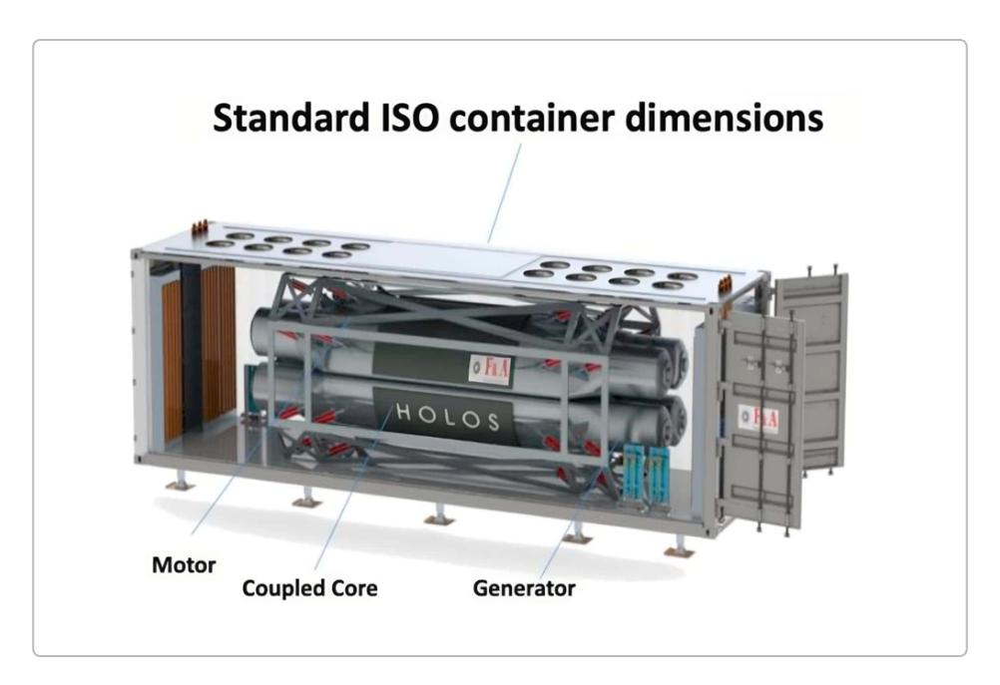

# Применение искусственного интеллекта в атомной энергетике

### Введение

Искусственный интеллект (ИИ) стремительно внедряется в атомную энергетику, открывая новые возможности для повышения эффективности и безопасности ядерных объектов. Современные алгоритмы машинного обучения, нейронные сети и методы анализа данных позволяют проактивно управлять сложными ядерными системами, оптимизировать их работу и предвидеть потенциальные проблемы. В последние 5–10 лет ядерная отрасль начала активно исследовать применение ИИ – от поддержки операторов АЭС до автономного управления реакторами. Международные организации (например, МАГАТЭ) также поддерживают эту тенденцию, организуя рабочие группы и выпуская отчёты по ИИ в атомной энергетике. Ниже приводится обзор ключевых направлений использования ИИ в атомной энергетике и соответствующих реализаций, а также отдельный обзор программных симуляторов, применяемых в ядерной отрасли.

### Управление и оптимизация работы ядерных реакторов

ИИ позволяет перейти от статических моделей управления реактором к интеллектуальному, адаптивному контролю. Автономное управление реактором. Ведутся исследования по применению методов глубокого обучения и reinforcement learning для автоматизированного регулирования мощности и других параметров реактора в реальном времени. Например, в недавнем исследовании для микрореактора Holos-Quad использовано глубокое reinforcement learning для управления поворотными барабанами регулирования реактивности; алгоритм обучался управлять восемью барабанами одновременно и смог поддерживать заданный уровень мощности даже при помехах в показаниях датчиков, превзойдя классический PID-контроллер 1 2. В неидеальных сценариях (шум датчиков, флуктуации условий) такой ИИ-контроллер удерживал ошибку регулирования ниже, чем PID, при в 1,5 раза меньших затратах управления 1. Кроме того, мультиагентный подход сократил время обучения как минимум вдвое по сравнению с одноагентным 3 . Эти результаты демонстрируют потенциал ИИ для автономного load-following и других режимов работы реакторов, особенно перспективных для микрореакторов и космических реакторных установок, требующих минимального участия человека 4 5. Полностью автономное управление пока требует дальнейшей валидации, но уже предпринимаются шаги к созданию «цифровых двойников», где ИИ в реальном времени моделирует и корректирует действия системы 2.

Оптимизация режимов и эффективности. ИИ-системы способны в режиме реального времени обрабатывать большие массивы эксплуатационных данных АЭС и находить оптимальные параметры работы установки. Например, алгоритмы могут автоматически подстраивать распределение нагрузки между реакторными установками, регулировать подачу теплоносителя или настройку турбин, чтобы максимизировать КПД и выработку энергии. В практике уже имеются примеры: компания Blue Wave AI Labs внедрила ИИ-инструменты на АЭС Peach Bottom и Limerick (Constellation Energy, США) для оптимизации режима работы. По оценкам, эти инструменты позволяют экономить

более 1,6 млн долл. в год на реактор за счёт снижения расхода топлива, сокращения простоев и ускорения анализов при планировании . В целом переход от ручного планирования к управлению, основанному на данных и прогнозах ИИ, повышает коэффициент использования оборудования и продлевает ресурс ядерных установок . [6](https://www.nuclearbusiness-platform.com/media/insights/role-of-artificial-intelligence-in-shaping-the-future-of-nuclear-power#:~:text=%2A%20Real,spent%20on%20analysis%20and%20planning) [7](https://www.nuclearbusiness-platform.com/media/insights/role-of-artificial-intelligence-in-shaping-the-future-of-nuclear-power#:~:text=moving%20from%20reactive%20problem,new%20talent%20and%20capital%20investment)

*Прототип микрореактора Holos-Quad в габаритах стандартного контейнера. Для таких компактных реакторов разрабатываются ИИ-алгоритмы управления мощностью и системами охлаждения, способные автономно поддерживать безопасный режим работы без участия оператора . [1](https://news.engin.umich.edu/2025/06/reinforcement-learning-for-nuclear-microreactor-control/#:~:text=Reinforcement%20learning%20approaches%20achieved%20similar,the%20solution%20with%20less%20effort) [2](https://news.engin.umich.edu/2025/06/reinforcement-learning-for-nuclear-microreactor-control/#:~:text=The%20technique%20needs%20extensive%20validation,learning%20in%20autonomous%20nuclear%20microreactors)*

# **Прогнозирование отказов и предиктивное обслуживание**

Одна из самых востребованных областей применения ИИ в атомной энергетике – предиктивная диагностика оборудования и предотвращение аварийных отказов. **Анализ данных датчиков.** Ядерные энергоблоки оснащены тысячами датчиков, непрерывно собирающих информацию о состоянии реакторной установки и вспомогательных систем. ИИ-алгоритмы способны обнаруживать в этих больших массивах данных тонкие аномалии, указывающие на зарождающиеся отклонения. Например, нейросеть, разработанная исследователями Университета Иллинойса (США), позволяет прогнозировать параметры состояния реактора **в 1400 раз быстрее** традиционных методов моделирования . Такая система мгновенно выявляет отклонения в показаниях и предсказывает развитие ситуации, давая операторам больше времени на реакцию. [8](https://www.nuclearbusiness-platform.com/media/insights/ai-meets-nuclear#:~:text=costs%20by%20as%20much%20as,DOE%29%20and%20the) [9](https://www.nuclearbusiness-platform.com/media/insights/role-of-artificial-intelligence-in-shaping-the-future-of-nuclear-power#:~:text=,identifying%20concerns%20before%20they%20escalate)

**Предиктивное техническое обслуживание.** Машинное обучение анализирует исторические данные о работе оборудования (насосов, клапанов, генераторов пара и пр.) и погодные/режимные факторы, чтобы предсказать вероятные точки отказа. Переход от планово-предупредительного обслуживания к обслуживанию «по состоянию» с помощью ИИ позволяет проводить ремонты именно тогда, когда это действительно необходимо, и предотвращать внезапные поломки. По оценкам, такие ИИ-системы способны сократить незапланированные простои оборудования до 50% и снизить расходы на ремонт на ~30% . Так, компания Exelon (Constellation Energy) совместно с Blue Wave AI Labs применяет ИИ для прогноза состояния ключевых компонентов на ряде АЭС, что [10](https://www.nuclearbusiness-platform.com/media/insights/ai-meets-nuclear#:~:text=and%20technological%20frontier.%20AI,sophisticated%20threats%20through%20live%20anomaly) [11](https://www.nuclearbusiness-platform.com/media/insights/role-of-artificial-intelligence-in-shaping-the-future-of-nuclear-power#:~:text=,costs%20by%20up%20to%2030)

уже привело к экономии миллионов долларов в год на каждом блоке . Проект, поддержанный Министерством энергетики США, объединил данные с ~15 энергоблоков (BWR) за несколько топливных циклов и разработал набор моделей машинного обучения для раннего обнаружения дефектов и оценки остаточного ресурса узлов . Глубокие нейросети помогают выделять слабые сигналы деградации среди шумных параметров и распознавать *предшественники отказов* – комбинации показателей, характерные для начинающегося износа . Такие модели уже сейчас позволяют находить скрытые дефекты (например, трещины в трубопроводах, дрейф калибровки датчиков) до того, как они перерастают в серьёзные неисправности . В результате сокращается количество внеплановых остановов, повышается надёжность и безопасность работы станции, а технический персонал получает интеллектуальные рекомендации, на какие узлы обратить внимание в первую очередь. [10](https://www.nuclearbusiness-platform.com/media/insights/ai-meets-nuclear#:~:text=and%20technological%20frontier.%20AI,sophisticated%20threats%20through%20live%20anomaly) [12](https://www.energy.gov/ne/articles/blue-wave-capital-and-consulting-dba-blue-wave-ai-labs-advanced-reactor-development#:~:text=precursors%20to%20component%20failure,1%29%20develop%20enhanced) [13](https://www.energy.gov/ne/articles/blue-wave-capital-and-consulting-dba-blue-wave-ai-labs-advanced-reactor-development#:~:text=to%20improve%20the%20diagnostic%20and,linear%20operational%20parameters%2C%20detecting%20anomalies) [14](https://www.energy.gov/ne/articles/blue-wave-capital-and-consulting-dba-blue-wave-ai-labs-advanced-reactor-development#:~:text=diverse%2C%20including%20things%20such%20as,amounts%20of%20structured%20and%20unstructured) [15](https://www.energy.gov/ne/articles/blue-wave-capital-and-consulting-dba-blue-wave-ai-labs-advanced-reactor-development#:~:text=implementation%20of%20enhanced%20diagnostic%20and,assets%20through%20advanced%20machine%20learning) [14](https://www.energy.gov/ne/articles/blue-wave-capital-and-consulting-dba-blue-wave-ai-labs-advanced-reactor-development#:~:text=diverse%2C%20including%20things%20such%20as,amounts%20of%20structured%20and%20unstructured)

## **Оптимизация топливных циклов и ядерных материалов**

ИИ нашёл применение и в вопросах, связанных с ядерным топливом – от разработки оптимальных загрузок активной зоны до планирования всего топливного цикла. **Проектирование активной зоны.** Распределение топливных сборок в активной зоне реактора существенно влияет на выгорание топлива, коэффициент воспроизводства и распределение мощностей. Задача поиска оптимальной загрузки крайне сложна из-за огромного числа возможных комбинаций. Здесь успешно применяются эволюционные алгоритмы (генетические алгоритмы) и методы оптимизации с помощью ИИ. Например, система CIGARO была разработана для оптимизации загрузки топлива в PWR с использованием генетического алгоритма, комбинируя его с нейтронно-физическими расчётами кода CASMO/SIMULATE . В тестовых задачах CIGARO сумела увеличить коэффициент размножения \$k\_{\text{эфф}}\$ на начале цикла при одновременном снижении пикового локального энерговыделения за счёт более равномерного распределения топлива . Алгоритм генерирует множество вариантов загрузки, отфильтровывает их по критериям (лимиты по мощности, по размещению свежего/выгоревшего топлива и т.д.) и эволюционно «улучшает» решения. Подобные подходы сегодня используются при проектировании активных зон как традиционных энергетических реакторов, так и перспективных – например, при оптимизации загрузки быстрых реакторов или высокотемпературных реакторов с шаровым топливом. [16](https://www.ans.org/pubs/journals/nt/article-35149/#:~:text=The%20code%20independent%20genetic%20algorithm,showed%20the%20potential%20for%20a) [17](https://www.ans.org/pubs/journals/nt/article-35149/#:~:text=algorithms%20%28GAs%29%20and%20a%20code,showed%20the%20potential%20for%20a)

**Управление ядерным топливным циклом.** На уровне всего топливного цикла ИИ применяется для сценарного анализа и принятия решений: сколько топлива облучать до выгрузки, как комбинировать свежие и частично выгоревшие сборки, когда направлять топливо на переработку или захоронение. Специализированные программы-симуляторы (см. обзор ниже) моделируют материальные потоки в ядерном топливном цикле, и на их основе методы искусственного интеллекта могут искать оптимальные стратегии. Например, агентные модели в симуляторе **Cyclus** позволяют с помощью ИИ просчитывать сотни вариантов развития ядерного энергетического парка (разные темпы ввода реакторов, варианты переработки отработавшего топлива, замыкание топливного цикла и пр.) и оценивать их по множеству критериев – экономическим, экологическим, по ресурсам урана и накоплению отходов . Для сложных замкнутых циклов с переработкой ИИ помогает балансировать потребности в свежем и вторичном топливе, определять, какие технологии наиболее выгодны для внедрения к определённому году. Кроме того, ИИ применяется в конкретных операциях топливного цикла – например, для **классификации и сортировки радиоактивных отходов** по уровням активности. Нейросети уже используются для автоматического распознавания и разделения отходов, оптимизируя их переработку и утилизацию . Алгоритмы компьютерного зрения могут анализировать изображения или сигналы от детекторов на конвейере переработки [18](https://doaj.org/article/d185d68c05244c748f8a1a4b23070fa4#:~:text=Nuclear%20fuel%20cycle%20scenario%20studies,CEA%20reference%20nuclear%20fuel%20cycle) [19](https://www.nuclearbusiness-platform.com/media/insights/ai-meets-nuclear#:~:text=detection%2C%20as%20prioritized%20by%20the,a%20legacy%20asset%20into%20a)

отходов, автоматически определяя категорию отхода и требуемый метод обращения с ним. Это повышает безопасность работников и эффективность обращения с РАО.

### Анализ безопасности и надёжности

Обеспечение ядерной безопасности – приоритетная область, где ИИ способен существенно усилить традиционные методы. Мониторинг и раннее обнаружение аварийных ситуаций. ИИ-системы сбора и анализа данных работают круглосуточно, сопоставляя тысячи параметров работы реактора и станции. Благодаря обучению на больших массивах данных (в том числе на симуляциях аварийных режимов) такие системы могут с небывалой скоростью и точностью выявлять зарождение нештатных ситуаций 9. К примеру, аномальное сочетание сигналов (рост вибрации насоса при одновременном незначительном снижении потока и повышении температуры обмотки двигателя) может не привлечь внимания оператора, но обученная модель ИИ сразу распознает паттерн, соответствующий началу деградации насосного агрегата, и выдаст предупреждение. На исследовательских реакторах уже испытываются ИИ, которые в реальном времени прогнозируют развитие аварий – например, по начальным отклонениям прогнозируют, перерастёт ли событие в аварию типа потери теплоносителя или останется в пределах проектных нарушений. Это даёт ценные секунды или минуты форы для срабатывания автоматических защит и действий персонала.

Совершенствование систем защиты и управления. Методы объяснимого ИИ (ХАІ) позволяют анализировать большие вероятностные модели (деревья событий, разветвлённые аварийные сценарии) и находить в них слабые звенья – комбинации отказов, дающие наибольший вклад в риск. Таким образом улучшаются Probabilistic Safety Assessment (PSA) и выявляются, например, малоочевидные зависимости между разными системами безопасности. Также ИИ применяется для оптимизации конфигурации систем контроля и управления (СКУ): нейросеть может перебрать множество вариантов настройки порогов срабатывания, логики действия автоматик и предложить такую комбинацию, которая минимизирует частоту ложных срабатываний при сохранении надёжности. Кроме того, ИИ помогает в задачах кибербезопасности ядерных объектов. АЭС всё больше цифровизируются, и угрозы кибератак становятся значимым фактором. Алгоритмы машинного обучения обучаются на сетевом трафике технологических систем и умеют в режиме реального времени выявлять подозрительную активность (например, аномальные команды контроллерам, характерные для вредоносного кода). Системы кибермониторинга на основе ИИ, поддерживаемые Министерством энергетики США и Национальным управлением по ядерной безопасности, уже внедряются для защиты критических узлов ядерных объектов 20 21.

Снижение влияния человеческого фактора. Автоматизация рутины и интеллектуальная поддержка операторов – ещё один способ повысить безопасность. ИИ может брать на себя выполнение регламентных последовательностей действий или непрерывный контроль отдельных параметров, избавляя персонал от усталости и перегрузки информацией. Например, интеллектуальная система поддержки оператора может отслеживать сотни сигналов и при отклонениях сразу предлагать оператору рекомендации: "Закрыть клапан X, включить насос Y – вероятно, утечка в первом контуре", обосновывая это тем, что подобная комбинация признаков уже встречалась в аварийных сценариях. Ещё с 1980-х годов в ядерной отрасли разрабатывались экспертные системы для диагностики аварий (известны системы, помогавшие операторам идентифицировать аварию типа ТМІ-2 по сочетанию срабатываний сигнализаций). Современные ИИ-помощники стали гораздо более продвинутыми: они могут в диалоговом режиме отвечать на вопросы оператора, объяснять последовательность действий по аварийному регламенту, проверять,

не упущен ли какой-то шаг. Большие языковые модели и генеративный ИИ в будущем способны сыграть роль своеобразного «второго советника» в главном щите управления, который в реальном времени анализирует обстановку и подсказывает оптимальные действия (при этом окончательное решение остаётся за человеком). За счёт вовремя предоставленной информации и исключения человеческих ошибок (например, пропуска тревожного сигнала среди тысячи лампочек) снижается вероятность неправильных действий оператора в критической ситуации 22 23.

### Интеллектуальные помощники и обучение персонала

ИИ активно используется не только непосредственно в управлении реактором, но и в смежных задачах подготовки и поддержки персонала. **Цифровые ассистенты и экспертные системы.** Как отмечалось, современные АЭС начинают внедрять интеллектуальные подсказчики для дежурного персонала. Эти системы, опираясь на заложенные базы знаний (анализ проектной документации, аварийных инструкций, прошлых инцидентов), способны отвечать на запросы операторов на естественном языке или через специальные интерфейсы. Например, инженер может спросить: "Какие параметры свидетельствуют о неисправности парогенератора?" – и система мгновенно выдаст список признаков и рекомендуемые проверочные действия, основываясь на опыте эксплуатации и заложенных экспертизах. Такие помощники особенно полезны новым сотрудникам, помогая быстрее ориентироваться в сложных регламентах. На некоторых АЭС мира внедрены прототипы чат-ботов для технического обслуживания, которые могут подсказать последовательность операций ремонта или предоставить справку по оборудованию.

Обучение и тренажёры. Методы ИИ применяются для создания реалистичных симуляторов реакторных процессов и обучения персонала в виртуальной среде. С помощью машинного обучения симуляторы могут имитировать поведение установки с высокой точностью в разнообразных условиях, включая редкие аварийные ситуации, которые трудно воспроизвести на традиционных тренажёрах. Например, ИИ может генерировать сценарии развития аварии, слегка варьируя исходные условия, чтобы обучить операторов распознавать нетривиальные сигналы надвигающейся проблемы. Имитационное моделирование с ИИ также используется при отработке действий персонала в сложных авариях, когда сразу несколько систем выходят из строя сценарии, которые не предусмотрены стандартными программами подготовки. Виртуальные тренажёры с элементами дополненной и виртуальной реальности, усиленные ИИ, позволяют персоналу «погружаться» в цифровую копию блочного щита управления или инженерных систем. Интеллектуальный модуль может отслеживать действия обучаемого и в режиме реального времени давать обратную связь или вводить новые вводные (например, внезапный отказ насоса), оценивая реакцию. Это значительно повышает качество обучения, делая его ближе к реальной динамике происшествий.

Кроме того, ИИ помогает **обучать алгоритмы самих систем** – так называемое *обучение на основе моделирования*. Например, перед допуском ИИ-ассистента на настоящий энергоблок, его прогоняют через тысячи сценариев на цифровом двойнике станции, где он «учится» правильным действиям. Таким образом, повышается надёжность ИИ-систем перед их интеграцией в реальные объекты.

### Обзор симуляторов ядерных реакторов и связанных систем

Моделирование и симуляция – фундаментальная часть ядерной инженерии. С развитием открытого ПО и ростом вычислительных мощностей сегодня доступен широкий спектр симуляторов для реакторных и сопутствующих задач – от открытых кодов с исходниками до коммерческих лицензируемых продуктов. Ниже приведён обзор наиболее известных симуляторов ядерных реакторов и топливного цикла, с указанием их назначения, доступности (лицензии) и источников.

**ОрепМС.** Монте-Карло код транспортировки нейтронов и фотонов, предназначенный для точных нейтронно-физических расчетов в 3D-геометрии произвольной сложности 24. Поддерживает как стационарные расчёты (кинеценности \$k\_{\text{}}\$\phi\$}), так и расчёты с внешним источником, может работать с непрерывными энергиями на основе ядерных данных ENDF. OpenMC активно используется для моделирования активных зон, расчёта выгорания топлива, анализа экспериментов по критичности и т.д. Код открыт для совместной разработки сообществом и оптимизирован под высокопроизводительные вычисления (MPI/OpenMP параллелизм) 25. **Лицензия:** открыт в виде свободного ПО (лицензия МІТ) 26. **Источник:** проект поддерживается МІТ и Argonne National Lab, исходники доступны на <u>официальном сайте</u> и GitHub 27.

**Serpent 2.** Современный трёхмерный Монте-Карло код нейтронно-фотонного транспорта, разработанный в Центре технических исследований VTT (Финляндия). Предназначен для реакторных расчетов, обладает встроенным модулем выгорания топлива и способен генерировать групповые постоянные для связанных детерминистских кодов 28 29 . Serpent широко применяется в научных исследованиях и проектировании: от расчета отдельных твэлов и сборок до имитации полного ядра реактора, как тепловых, так и быстрых систем 29 . Код известен высокой производительностью за счёт оптимизаций и возможностью параллельных расчётов, что позволяет проводить детальные выжиговые расчёты активной зоны за приемлемое время 30 . **Лицензия:** бесплатно доступен для научно-исследовательских и учебных организаций (некоммерческое использование) по разрешению VTT 31 . Исходный код не является открытым, коммерческая версия с обеспечением качества распространяется через компанию Studsvik (Serpent-SSP) 32 33 . **Источник:** информация и запросы на некоммерческую версию – через [сайт VTT] 34 или NEA Data Bank; описание опубликовано в Annals of Nuclear Energy 35 .

**MCNP** (**Monte Carlo N-Particle**). Классический универсальный Монте-Карло код, разработанный в Лос-Аламосской национальной лаборатории (США). Предназначен для моделирования переноса нейтронов, гамма-квантов, электронов и других частиц в сложной 3D-геометрии с непрерывным спектром энергии 36. МСNP применяется в самых разных областях: радиационная защита и экранирование, критичностной анализ, дозиметрия, проектирование детекторов, расчёт облучения материалов, ядерная медицина, оценка тепловыделения и пр. 36. Код содержит большую библиотеку ядерных данных и реализует множество методов ускорения расчётов (разделение историй, усреднение и т.д.) 37 38. **Лицензия:** распространяется как закрытый программный продукт; доступ регулируется экспортным законодательством США 39. Получение возможно через RSICC (США) или NEA Data Bank для организаций из стран-партнёров. **Источник:** официальный [сайт МСNР] (lanl.gov) содержит информацию о версиях; последняя актуальная версия – МСNP6.3 (2025 г.)

**RELAP5-3D.** Системный теплогидравлический код, разработанный для моделирования переходных режимов и аварий в системах охлаждения ядерных реакторов. RELAP5 позволяет детально

описывать поведение теплоносителя (вода, жидкие металлы, газы, расплавы солей и др.) в контурах реактора при различных нарушениях: от плановых манёвров мощности до аварийных ситуаций типа разрыва трубопровода, отказа питания, АЗ по разным причинам и пр. . Код включает модели двухфазного течения (пар/вода), теплообмена (кипение, конденсация, перенос тепла в стенках), работу оборудования (насосы, клапаны, парогенераторы и т.п.) и может сопрягаться с нейтронной кинетикой (0D точечная модель или многомерная нейтронная модель) . RELAP5-3D является одним из основных инструментов обоснования безопасности: он прошёл валидацию на обширном наборе экспериментов и принят регуляторами (например, NRC) для анализов обоснования проектов . **Лицензия:** код является собственностью Министерства энергетики США и распространяется по лицензии через Idaho National Lab; его экспорт контролируется (10 CFR Part 810) . Исходный код доступен лицензированным пользователям; имеется международное сообщество (RELAP5 User Group). **Источник:** официальный ресурс INL предоставляет информацию о версиях и лицензировании ; документированные возможности опубликованы в открытых источниках и руководствах NRC . [41](https://en.wikipedia.org/wiki/RELAP5-3D#:~:text=,Loss%20of%20flow) [42](https://en.wikipedia.org/wiki/RELAP5-3D#:~:text=,APWR%20%2C%20%20122%2C%20etc) [43](https://en.wikipedia.org/wiki/RELAP5-3D#:~:text=RELAP5,transients%20and%20postulated%20accidents%2C%20including) [44](https://en.wikipedia.org/wiki/RELAP5-3D#:~:text=There%20are%20two%20options%20that,14) [45](https://inl.gov/relap53d/#:~:text=Accredited%20by%20international%20benchmarks%20and,predicting%20thermal%20and%20fluid%20performance) [46](https://inl.gov/relap53d/#:~:text=RELAP5,the%20INL%20Code%20Oversight%20Group) [46](https://inl.gov/relap53d/#:~:text=RELAP5,the%20INL%20Code%20Oversight%20Group) [41](https://en.wikipedia.org/wiki/RELAP5-3D#:~:text=,Loss%20of%20flow)

**Cyclus.** Модульный агент-ориентированный симулятор ядерного топливного цикла. Предназначен для моделирования долгосрочных сценариев развития ядерной энергетики, отслеживания потоков ядерных материалов (уран, плутоний, актиноиды, продукты деления) между различными объектами цикла – реакторами, хранилищами, заводами по переработке и т.д. . Отличительная особенность Cyclus – гибкость и расширяемость: пользователи могут добавлять свои модели (агентов) для новых типов реакторов или технологий, а движок симуляции позволяет им обмениваться ресурсами (материалами) по заданным правилам . Таким образом, можно воспроизводить, например, конкуренцию между разными типами реакторов за ядерное топливо или эффект внедрения замкнутого топливного цикла. Cyclus широко используется в исследованиях по оценке стратегий ядерной энергетики, позволяя учитывать экономические, ресурсные и экологические показатели. **Лицензия:** открытый исходный код (написан на C++/Python), доступен под свободной лицензией (Apache 2.0). Проект развивается сообществом при участии университетов (Университет Висконсина, Университет Иллинойса и др.). **Источник:** официальный сайт [fuelcycle.org] и репозиторий на GitHub содержат код и документацию ; в открытой печати доступны описания концепции Cyclus и примеры верификации . [47](https://fuelcycle.org/#:~:text=Cyclus%20is%20the%20next,developed%20%207%20framework) [48](https://fuelcycle.org/#:~:text=The%20goal%20of%20Cyclus%20is,contribute%20to%20the%20Cyclus%20project) [47](https://fuelcycle.org/#:~:text=Cyclus%20is%20the%20next,developed%20%207%20framework) [49](https://fuelcycle.org/#:~:text=The%20Cyclus%20project%20repository%20is,com%2Fcyclus%2Fcyclus) [50](https://www.sciencedirect.com/science/article/abs/pii/S0965997816300229#:~:text=,the%20Cyclus%20tool%20from)

**COSI.** (Франция, CEA) – стратегический код для моделирования ядерных топливных циклов и сценариев на национальном уровне. Разрабатывается более 30 лет и используется как основной инструмент анализа топливной политики во Франции . COSI моделирует развертывание парка реакторов, загрузку/выгрузку топлива, процессы переработки, поток материалов между всеми стадиями цикла и накопление отходов. Позволяет рассчитывать многолетние сценарии с разными допущениями (ввод новых реакторов, переход на замкнутый цикл, внедрение быстрых реакторов и т.п.), помогая оптимизировать использование урана и минимизировать радиотоксичность отходов. Новейшая версия COSI7 (введена в 2020 г.) улучшена для моделирования сложных динамических систем и имеет удобный интерфейс для пользователей . **Лицензия:** проприетарный код CEA, доступен ограниченному кругу организаций по согласованию с CEA. Он не является открытым, однако результаты работ с COSI публикуются в открытой литературе. **Источник:** описание COSI7 представлено в материалах конференции PHYSOR 2020 (EPJ Web of Conferences) , также COSI упоминается в отчётах NEA как один из референсных инструментов для топливно-циклических исследований. [51](https://doaj.org/article/d185d68c05244c748f8a1a4b23070fa4#:~:text=order%20to%20provide%20stakeholders%20with,CEA%20reference%20nuclear%20fuel%20cycle) [52](https://doaj.org/article/d185d68c05244c748f8a1a4b23070fa4#:~:text=order%20to%20provide%20stakeholders%20with,simulation%20code%20starting%20January%202020) [52](https://doaj.org/article/d185d68c05244c748f8a1a4b23070fa4#:~:text=order%20to%20provide%20stakeholders%20with,simulation%20code%20starting%20January%202020)

**PC-симуляторы МАГАТЭ.** Помимо расчётных кодов, в атомной энергетике используются обучающие софтверные симуляторы. МАГАТЭ поддерживает коллекцию из ~10 **обучающих симуляторов ядерных реакторов** (Basic Principle Simulators) для различных типов: типовой PWR, продвинутый пассивный PWR, BWR, продвинутый ESBWR, ВВЭР-1000, тяжеловодный PHWR (CANDU) и др. . Эти программы устанавливаются на обычный ПК и дают приближённую динамическую модель работы соответствующего реактора – с характерными интерфейсами управления и индикацией параметров. Например, симулятор PWR (разработан на базе программы PCTRAN) позволяет воспроизводить типовые переходные процессы: разгрузку/нагрузку, выключение насоса, срабатывание защит, вплоть до тяжёлых аварий (LOCA, SBO, расплавление активной зоны) . С помощью таких симуляторов студенты и молодые специалисты могут в интерактивном режиме понять принципы работы АЭС, влияние различных систем и поведение реактора при нарушениях . **Лицензия и источник:** эти симуляторы разработаны по инициативе МАГАТЭ партнёрскими организациями (например, Tecnatom, Micro-Simulation Technology и др.) и предоставляются **бесплатно** для целей обучения в государствах-членах МАГАТЭ . Запрос на получение можно направить через МАГАТЭ; ПО не открыто в исходном коде, однако свободно распространяется для образовательных учреждений. Такие симуляторы активно применяются на региональных учебных курсах МАГАТЭ и в учебных центрах новых ядерных государств, помогая готовить персонал до появления полномасштабных тренажёров . [53](https://indico.ictp.it/event/a09144/session/9/contribution/5/material/0/2.pdf#:~:text=4,700) [54](https://indico.ictp.it/event/a09144/session/9/contribution/5/material/0/2.pdf#:~:text=%C2%89%20PWR%C2%89%20Advanced%20PWR%C2%89%20BWR%C2%89,700) [55](https://indico.ictp.it/event/a09144/session/9/contribution/5/material/0/2.pdf#:~:text=,reactor%20transient%20and%20accident%20simulation) [56](https://indico.ictp.it/event/a09144/session/9/contribution/5/material/0/2.pdf#:~:text=art%20for%20learning%20about%20Nuclear,provide%20the%20plant%20response%20information) [57](https://www.kaeri.re.kr/eng/board/view?pageNum=1&rowCnt=10&menuId=MENU00718&schType=0&schYear=&schText=&categoryId=&continent=&country=&boardStyle=&linkId=4900#:~:text=The%20IAEA%20has%20a%20collection,charge%20to%20IAEA%20Member%20States) [58](https://www.kaeri.re.kr/eng/board/view?pageNum=1&rowCnt=10&menuId=MENU00718&schType=0&schYear=&schText=&categoryId=&continent=&country=&boardStyle=&linkId=4900#:~:text=Small%20Modular%20Reactor%20,charge%20to%20IAEA%20Member%20States) [59](https://www.kaeri.re.kr/eng/board/view?pageNum=1&rowCnt=10&menuId=MENU00718&schType=0&schYear=&schText=&categoryId=&continent=&country=&boardStyle=&linkId=4900#:~:text=and%20is%20working%20continuously%20to,charge%20to%20IAEA%20Member%20States)

**Закрытые полнофункциональные тренажёры.** Наконец, упомянем о промышленных тренажёрных системах для подготовки персонала АЭС. Как правило, это коммерческие продукты (например, фирмы CORYS, GSE Systems и др.), представляющие **полномасштабные симуляторы** блочного щита управления конкретной станции. Они воспроизводят поведение всех систем АЭС в реальном времени и используются для тренировок операторов в ситуационном центре. Эти системы закрыты и специализированы под каждую станцию, поэтому их краткий обзор выходит за рамки данного списка. Однако стоит отметить, что современные тренажёры также начинают включать элементы ИИ – например, модули автоматической оценки действий обучаемых или генерации новых сценариев на основе предыдущих сессий.

**Выводы:** внедрение ИИ в атомной энергетике уже приносит ощутимые результаты – повышение надёжности за счёт предиктивного обслуживания, улучшение экономических показателей через оптимизацию процессов, усиление безопасности благодаря умному мониторингу. Одновременно растёт экосистема программных инструментов для моделирования реакторов и топливных циклов: открытые коды снижают барьер входа для исследований, а проверенные промышленные симуляторы обеспечивают необходимую точность для обоснования проектов. В дальнейшие годы можно ожидать ещё более тесной интеграции ИИ в цикл эксплуатации АЭС – вплоть до появления полностью цифровых атомных энергоблоков, где **цифровой интеллект** станет неотъемлемой частью управления и развития ядерно-энергетических систем.

**Источники:** Все приведённые данные и примеры основаны на открытых материалах и исследованиях последних лет, включая отчёты отраслевых организаций и научные публикации и др. [10](https://www.nuclearbusiness-platform.com/media/insights/ai-meets-nuclear#:~:text=and%20technological%20frontier.%20AI,sophisticated%20threats%20through%20live%20anomaly) [9](https://www.nuclearbusiness-platform.com/media/insights/role-of-artificial-intelligence-in-shaping-the-future-of-nuclear-power#:~:text=,identifying%20concerns%20before%20they%20escalate) [1](https://news.engin.umich.edu/2025/06/reinforcement-learning-for-nuclear-microreactor-control/#:~:text=Reinforcement%20learning%20approaches%20achieved%20similar,the%20solution%20with%20less%20effort) [12](https://www.energy.gov/ne/articles/blue-wave-capital-and-consulting-dba-blue-wave-ai-labs-advanced-reactor-development#:~:text=precursors%20to%20component%20failure,1%29%20develop%20enhanced)

Reinforcement learning for nuclear microreactor control - Michigan Engineering News <https://news.engin.umich.edu/2025/06/reinforcement-learning-for-nuclear-microreactor-control/> [1](https://news.engin.umich.edu/2025/06/reinforcement-learning-for-nuclear-microreactor-control/#:~:text=Reinforcement%20learning%20approaches%20achieved%20similar,the%20solution%20with%20less%20effort) [2](https://news.engin.umich.edu/2025/06/reinforcement-learning-for-nuclear-microreactor-control/#:~:text=The%20technique%20needs%20extensive%20validation,learning%20in%20autonomous%20nuclear%20microreactors) [3](https://news.engin.umich.edu/2025/06/reinforcement-learning-for-nuclear-microreactor-control/#:~:text=The%20multi,a%20slightly%20higher%20error%20rate) [4](https://news.engin.umich.edu/2025/06/reinforcement-learning-for-nuclear-microreactor-control/#:~:text=Small%20reactors%20sidestep%20the%20huge,need%20to%20operate%20completely%20autonomously) [5](https://news.engin.umich.edu/2025/06/reinforcement-learning-for-nuclear-microreactor-control/#:~:text=%E2%80%9CDeep%20reinforcement%20learning%20builds%20a,senior%20author%20of%20the%20study)

### The Role of Artificial Intelligence in Shaping the Future of Nuclear Power — Nuclear Business Platform [6](https://www.nuclearbusiness-platform.com/media/insights/role-of-artificial-intelligence-in-shaping-the-future-of-nuclear-power#:~:text=%2A%20Real,spent%20on%20analysis%20and%20planning) [7](https://www.nuclearbusiness-platform.com/media/insights/role-of-artificial-intelligence-in-shaping-the-future-of-nuclear-power#:~:text=moving%20from%20reactive%20problem,new%20talent%20and%20capital%20investment) [9](https://www.nuclearbusiness-platform.com/media/insights/role-of-artificial-intelligence-in-shaping-the-future-of-nuclear-power#:~:text=,identifying%20concerns%20before%20they%20escalate) [11](https://www.nuclearbusiness-platform.com/media/insights/role-of-artificial-intelligence-in-shaping-the-future-of-nuclear-power#:~:text=,costs%20by%20up%20to%2030) [21](https://www.nuclearbusiness-platform.com/media/insights/role-of-artificial-intelligence-in-shaping-the-future-of-nuclear-power#:~:text=,threats%20to%20the%20power%20grid) [22](https://www.nuclearbusiness-platform.com/media/insights/role-of-artificial-intelligence-in-shaping-the-future-of-nuclear-power#:~:text=,reducing%20the%20risk%20of%20misjudgment) [23](https://www.nuclearbusiness-platform.com/media/insights/role-of-artificial-intelligence-in-shaping-the-future-of-nuclear-power#:~:text=routine%20and%20repetitive%20tasks%2C%20thereby,reducing%20the%20risk%20of%20misjudgment)

<https://www.nuclearbusiness-platform.com/media/insights/role-of-artificial-intelligence-in-shaping-the-future-of-nuclear-power>

AI Meets Nuclear: The Power Play Reshaping Global Dominance — Nuclear Business Platform <https://www.nuclearbusiness-platform.com/media/insights/ai-meets-nuclear> [8](https://www.nuclearbusiness-platform.com/media/insights/ai-meets-nuclear#:~:text=costs%20by%20as%20much%20as,DOE%29%20and%20the) [10](https://www.nuclearbusiness-platform.com/media/insights/ai-meets-nuclear#:~:text=and%20technological%20frontier.%20AI,sophisticated%20threats%20through%20live%20anomaly) [19](https://www.nuclearbusiness-platform.com/media/insights/ai-meets-nuclear#:~:text=detection%2C%20as%20prioritized%20by%20the,a%20legacy%20asset%20into%20a) [20](https://www.nuclearbusiness-platform.com/media/insights/ai-meets-nuclear#:~:text=Real,DOE%29%20and%20the)

Heading 1 [12](https://www.energy.gov/ne/articles/blue-wave-capital-and-consulting-dba-blue-wave-ai-labs-advanced-reactor-development#:~:text=precursors%20to%20component%20failure,1%29%20develop%20enhanced) [13](https://www.energy.gov/ne/articles/blue-wave-capital-and-consulting-dba-blue-wave-ai-labs-advanced-reactor-development#:~:text=to%20improve%20the%20diagnostic%20and,linear%20operational%20parameters%2C%20detecting%20anomalies) [14](https://www.energy.gov/ne/articles/blue-wave-capital-and-consulting-dba-blue-wave-ai-labs-advanced-reactor-development#:~:text=diverse%2C%20including%20things%20such%20as,amounts%20of%20structured%20and%20unstructured) [15](https://www.energy.gov/ne/articles/blue-wave-capital-and-consulting-dba-blue-wave-ai-labs-advanced-reactor-development#:~:text=implementation%20of%20enhanced%20diagnostic%20and,assets%20through%20advanced%20machine%20learning)

<https://www.energy.gov/ne/articles/blue-wave-capital-and-consulting-dba-blue-wave-ai-labs-advanced-reactor-development>

Nuclear Technology -- ANS / Publications / Journals / Nuclear Technology <https://www.ans.org/pubs/journals/nt/article-35149/> [16](https://www.ans.org/pubs/journals/nt/article-35149/#:~:text=The%20code%20independent%20genetic%20algorithm,showed%20the%20potential%20for%20a) [17](https://www.ans.org/pubs/journals/nt/article-35149/#:~:text=algorithms%20%28GAs%29%20and%20a%20code,showed%20the%20potential%20for%20a)

#### COSI7: THE NEW CEA REFERENCE ELECTRO-NUCLEAR SIMULATION TOOL – DOAJ [18](https://doaj.org/article/d185d68c05244c748f8a1a4b23070fa4#:~:text=Nuclear%20fuel%20cycle%20scenario%20studies,CEA%20reference%20nuclear%20fuel%20cycle) [51](https://doaj.org/article/d185d68c05244c748f8a1a4b23070fa4#:~:text=order%20to%20provide%20stakeholders%20with,CEA%20reference%20nuclear%20fuel%20cycle) [52](https://doaj.org/article/d185d68c05244c748f8a1a4b23070fa4#:~:text=order%20to%20provide%20stakeholders%20with,simulation%20code%20starting%20January%202020)

<https://doaj.org/article/d185d68c05244c748f8a1a4b23070fa4>

#### The OpenMC Monte Carlo Code — OpenMC Documentation [24](https://docs.openmc.org/en/stable/#:~:text=OpenMC%20is%20a%20community,MPI%20and%20OpenMP%20programming%20model) [25](https://docs.openmc.org/en/stable/#:~:text=continuous,MPI%20and%20OpenMP%20programming%20model) [27](https://docs.openmc.org/en/stable/#:~:text=OpenMC%20was%20originally%20developed%20by,on%20the%20OpenMC%20Discourse%20Forum)

<https://docs.openmc.org/en/stable/>

#### License Agreement — OpenMC Documentation [26](https://docs.openmc.org/en/stable/license.html#:~:text=Permission%20is%20hereby%20granted%2C%20free,subject%20to%20the%20following%20conditions)

<https://docs.openmc.org/en/stable/license.html>

SERPENT - NEA Data Bank GitLab platform [28](https://databank.io.oecd-nea.org/codes/serpent/#:~:text=SERPENT%20is%20a%20three,reaction%20rates%20and%20spectral%20quantities) [29](https://databank.io.oecd-nea.org/codes/serpent/#:~:text=SERPENT%20can%20be%20used%20for,educational%2C%20training%20and%20demonstration%20purposes) [30](https://databank.io.oecd-nea.org/codes/serpent/#:~:text=Internal%20burnup%20calculation%20capability%20allows,be%20further%20reduced%20by%20parallelization) [31](https://databank.io.oecd-nea.org/codes/serpent/#:~:text=Non) [34](https://databank.io.oecd-nea.org/codes/serpent/#:~:text=The%20NEA%20Data%20Bank%20offers,website%20for%20more%20practical%20information) [35](https://databank.io.oecd-nea.org/codes/serpent/#:~:text=Lepp%C3%A4nen%2C%20J,150.%20DOI%3A10.1016%2Fj.anucene.2014.08.024)

<https://databank.io.oecd-nea.org/codes/serpent/>

#### Studsvik Scandpower and VTT Partner to Bring QA Serpent to Nuclear Industry [32](https://www.prnewswire.com/news-releases/studsvik-scandpower-and-vtt-partner-to-bring-qa-serpent-to-nuclear-industry-301579463.html#:~:text=Industry%20customers%20need%20a%20QA,free%20of%20charge%20through%20VTT) [33](https://www.prnewswire.com/news-releases/studsvik-scandpower-and-vtt-partner-to-bring-qa-serpent-to-nuclear-industry-301579463.html#:~:text=Serpent%20is%20a%20multi,250%20organizations%20around%20the%20world)

[https://www.prnewswire.com/news-releases/studsvik-scandpower-and-vtt-partner-to-bring-qa-serpent-to-nuclear](https://www.prnewswire.com/news-releases/studsvik-scandpower-and-vtt-partner-to-bring-qa-serpent-to-nuclear-industry-301579463.html)[industry-301579463.html](https://www.prnewswire.com/news-releases/studsvik-scandpower-and-vtt-partner-to-bring-qa-serpent-to-nuclear-industry-301579463.html)

#### Monte Carlo N-Particle Transport Code - Wikipedia [36](https://en.wikipedia.org/wiki/Monte_Carlo_N-Particle_Transport_Code#:~:text=Monte%20Carlo%20N,code%20treats%20an%20arbitrary%20three) [37](https://en.wikipedia.org/wiki/Monte_Carlo_N-Particle_Transport_Code#:~:text=Important%20standard%20features%20that%20make,section%20data) [39](https://en.wikipedia.org/wiki/Monte_Carlo_N-Particle_Transport_Code#:~:text=nuclear%20and%20atomic%20databases%20and,significant%20testing%20by%20its%20users) [40](https://en.wikipedia.org/wiki/Monte_Carlo_N-Particle_Transport_Code#:~:text=Developer%20%2052%20Stable%20release)

[https://en.wikipedia.org/wiki/Monte\\_Carlo\\_N-Particle\\_Transport\\_Code](https://en.wikipedia.org/wiki/Monte_Carlo_N-Particle_Transport_Code)

#### MCNP6.3.1 [38](https://rsicc.ornl.gov/codes/ccc/ccc8/ccc-870.html#:~:text=The%20MCNP%C2%AE%2C%20Monte%20Carlo%20N,the%20MCNP%C2%AE%20code%2C%20major%20work)

<https://rsicc.ornl.gov/codes/ccc/ccc8/ccc-870.html>

RELAP5-3D - Wikipedia [41](https://en.wikipedia.org/wiki/RELAP5-3D#:~:text=,Loss%20of%20flow) [42](https://en.wikipedia.org/wiki/RELAP5-3D#:~:text=,APWR%20%2C%20%20122%2C%20etc) [43](https://en.wikipedia.org/wiki/RELAP5-3D#:~:text=RELAP5,transients%20and%20postulated%20accidents%2C%20including) [44](https://en.wikipedia.org/wiki/RELAP5-3D#:~:text=There%20are%20two%20options%20that,14)

<https://en.wikipedia.org/wiki/RELAP5-3D>

#### RELAP5-3D - Idaho National Laboratory [45](https://inl.gov/relap53d/#:~:text=Accredited%20by%20international%20benchmarks%20and,predicting%20thermal%20and%20fluid%20performance) [46](https://inl.gov/relap53d/#:~:text=RELAP5,the%20INL%20Code%20Oversight%20Group)

<https://inl.gov/relap53d/>

Cyclus — Home [47](https://fuelcycle.org/#:~:text=Cyclus%20is%20the%20next,developed%20%207%20framework) [48](https://fuelcycle.org/#:~:text=The%20goal%20of%20Cyclus%20is,contribute%20to%20the%20Cyclus%20project) [49](https://fuelcycle.org/#:~:text=The%20Cyclus%20project%20repository%20is,com%2Fcyclus%2Fcyclus)

<https://fuelcycle.org/>

#### Fundamental concepts in the Cyclus nuclear fuel cycle simulation ... [50](https://www.sciencedirect.com/science/article/abs/pii/S0965997816300229#:~:text=,the%20Cyclus%20tool%20from)

<https://www.sciencedirect.com/science/article/abs/pii/S0965997816300229>

#### IAEA Collection of PC-Based Nuclear Reactor Simulators for Educational Purposes [53](https://indico.ictp.it/event/a09144/session/9/contribution/5/material/0/2.pdf#:~:text=4,700) [54](https://indico.ictp.it/event/a09144/session/9/contribution/5/material/0/2.pdf#:~:text=%C2%89%20PWR%C2%89%20Advanced%20PWR%C2%89%20BWR%C2%89,700) [55](https://indico.ictp.it/event/a09144/session/9/contribution/5/material/0/2.pdf#:~:text=,reactor%20transient%20and%20accident%20simulation) [56](https://indico.ictp.it/event/a09144/session/9/contribution/5/material/0/2.pdf#:~:text=art%20for%20learning%20about%20Nuclear,provide%20the%20plant%20response%20information)

<https://indico.ictp.it/event/a09144/session/9/contribution/5/material/0/2.pdf>

### Upgraded Nuclear Reactor Simulator Enhances Training Opportunities for Member States < KAERI News < News & Information - 한국원자력연구원 대표 홈페이지(영문) [57](https://www.kaeri.re.kr/eng/board/view?pageNum=1&rowCnt=10&menuId=MENU00718&schType=0&schYear=&schText=&categoryId=&continent=&country=&boardStyle=&linkId=4900#:~:text=The%20IAEA%20has%20a%20collection,charge%20to%20IAEA%20Member%20States) [58](https://www.kaeri.re.kr/eng/board/view?pageNum=1&rowCnt=10&menuId=MENU00718&schType=0&schYear=&schText=&categoryId=&continent=&country=&boardStyle=&linkId=4900#:~:text=Small%20Modular%20Reactor%20,charge%20to%20IAEA%20Member%20States) [59](https://www.kaeri.re.kr/eng/board/view?pageNum=1&rowCnt=10&menuId=MENU00718&schType=0&schYear=&schText=&categoryId=&continent=&country=&boardStyle=&linkId=4900#:~:text=and%20is%20working%20continuously%20to,charge%20to%20IAEA%20Member%20States)

[https://www.kaeri.re.kr/eng/board/view?](https://www.kaeri.re.kr/eng/board/view?pageNum=1&rowCnt=10&menuId=MENU00718&schType=0&schYear=&schText=&categoryId=&continent=&country=&boardStyle=&linkId=4900)

[pageNum=1&rowCnt=10&menuId=MENU00718&schType=0&schYear=&schText=&categoryId=&continent=&country=&boardStyle=&linkId=4900](https://www.kaeri.re.kr/eng/board/view?pageNum=1&rowCnt=10&menuId=MENU00718&schType=0&schYear=&schText=&categoryId=&continent=&country=&boardStyle=&linkId=4900)